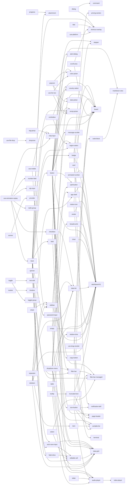

# 00 — Dependency graph (mermaid)

Edges point from dependency to consumer. Leaves (T0) with no consumers and no imports are omitted for legibility; they are listed in `00-register.md`.

```mermaid
graph LR
  progress --> attachment
  spinner --> attachment
  spinner --> badge
  dropdown-menu --> breadcrumb
  spinner --> button
  use-animation-replay --> checkbox
  dialog --> command
  use-file-drop --> dropzone
  use-animation-replay --> input
  separator --> item
  use-animation-replay --> number-field
  use-animation-replay --> otp-input
  sonner --> provider
  use-animation-replay --> radio-group
  tooltip --> relative-time
  separator --> sidebar
  sheet --> sidebar
  skeleton --> sidebar
  use-mobile --> sidebar
  toggle --> text-edit
  marker --> timeline
  toggle --> toggle-group
  tooltip --> truncated-text
  button --> alert-dialog
  sidebar --> app-shell
  skeleton --> app-shell
  input --> auto-save-input
  spinner --> auto-save-input
  input --> chip-input
  tag-group --> chip-input
  use-animation-replay --> chip-input
  button --> color-picker
  popover --> color-picker
  use-list-nav --> color-picker
  button --> copy-button
  button --> country-select
  combobox --> country-select
  checkbox --> data-list
  empty --> data-list
  skeleton --> data-list
  table --> data-list
  button --> date-picker
  popover --> date-picker
  button --> emoji-picker
  input --> emoji-picker
  popover --> emoji-picker
  use-list-nav --> emoji-picker
  input --> field
  input --> field-inline
  button --> filter-bar
  dropdown-menu --> filter-bar
  input --> filter-bar
  button --> icon-button
  button --> message-scroller
  input --> password-input
  badge --> pricing-section
  button --> region-select
  combobox --> region-select
  input --> region-select
  dialog --> shortcut-overlay
  input --> shortcut-overlay
  kbd --> shortcut-overlay
  scroll-area --> shortcut-overlay
  use-platform --> shortcut-overlay
  button --> split-button
  dropdown-menu --> split-button
  button --> stepper
  status-icon --> stepper
  button --> audio-player
  dropdown-menu --> audio-player
  icon-button --> audio-player
  slider --> audio-player
  tooltip --> audio-player
  badge --> board
  button --> board
  card --> board
  dropdown-menu --> board
  empty --> board
  icon-button --> board
  scroll-area --> board
  use-drag-reorder --> board
  use-mobile --> board
  copy-button --> code-block
  animated-number --> dashboard-01
  app-shell --> dashboard-01
  avatar --> dashboard-01
  badge --> dashboard-01
  breadcrumb --> dashboard-01
  button --> dashboard-01
  card --> dashboard-01
  chart --> dashboard-01
  data-list --> dashboard-01
  dropdown-menu --> dashboard-01
  empty --> dashboard-01
  relative-time --> dashboard-01
  sidebar --> dashboard-01
  skeleton --> dashboard-01
  status-icon --> dashboard-01
  truncated-text --> dashboard-01
  auto-save-input --> editable-cell
  field-inline --> editable-cell
  select --> editable-cell
  spinner --> editable-cell
  button --> filter-bar-managed
  filter-bar --> filter-bar-managed
  icon-button --> filter-bar-managed
  input --> filter-bar-managed
  select --> filter-bar-managed
  badge --> notification-bell
  icon-button --> notification-bell
  button --> page-header
  icon-button --> page-header
  truncated-text --> page-header
  dropdown-menu --> sortable-list
  icon-button --> sortable-list
  item --> sortable-list
  use-drag-reorder --> sortable-list
  copy-button --> terminal
  auto-save-input --> data-grid
  button --> data-grid
  checkbox --> data-grid
  dropdown-menu --> data-grid
  editable-cell --> data-grid
  empty --> data-grid
  skeleton --> data-grid
  table --> data-grid
  checkbox --> markdown-view
  code-block --> markdown-view
  audio-player --> video-player
```
