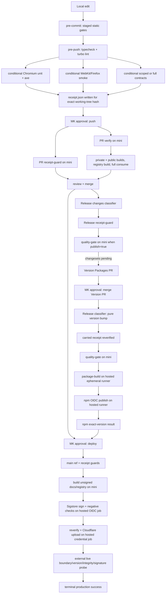

# CI/CD and release-efficiency audit

Status: **research and adversarial plan review complete; ready for staged implementation after
explicit MK approval; no implementation authorized**

Date: 2026-07-28

Repository state audited: `origin/main` at
`487a85b710493dad5bb6081776658a37d17f5d26` after `git fetch --prune origin`

Approval boundary: stop after this document. Pushing, merging, publishing, deploying, changing
repository settings, changing Cloudflare Access, and implementing any work package require separate
MK approval.

## 1. Executive diagnosis

The incident took hours for five different reasons. They should not be collapsed into “CI was slow.”

| class                    | observed contribution                                                                                                                                                                                                                                                                                | diagnosis                                                                                                                                                                                                                                                                                                                       |
| ------------------------ | ---------------------------------------------------------------------------------------------------------------------------------------------------------------------------------------------------------------------------------------------------------------------------------------------------- | ------------------------------------------------------------------------------------------------------------------------------------------------------------------------------------------------------------------------------------------------------------------------------------------------------------------------------- |
| Unavoidable validation   | The final ship evidence included 4,408 runnable browser tests, five capability skips, and 864/864 contracts over 108 routes. The retained final contract report alone took **645.113s**. The full shadcn consume proof measured **237.33s** locally in this audit.                                   | These checks protect real browser, accessibility, registry-graph, alias-rewrite, post-write-integrity, and consumer-compile contracts. The work is legitimate. Its scheduling and reuse are the optimization surface, not its deletion.                                                                                         |
| Avoidable duplicate work | A full ship receipt can be followed by pre-push running the same full contract sweep. `gates.mjs` then rewrites the receipt from scratch, so weaker push evidence can replace stronger ship evidence (`tooling/gates.mjs:593-652`, `684-690`).                                                       | The receipt is a snapshot, not a monotonic evidence set. Exact-tree ship evidence is not reused. One observed full contract run was 645.113s; the second approximately 661s cited in the incident transcript is not retained in a committed report, so it remains an estimate rather than a measured value.                     |
| Runner/cache time        | In current-topology CI jobs, `actions/setup-node` with `cache: pnpm` took 2s, 11m44s, 4m45s, 10m03s, and 44s across five inspected `verify` jobs. PR #19 attempt 1 spent minutes restoring a 296,198,670-byte cache, timed out at 98.6%, and was manually rerun.                                     | This was not runner queue time. Jobs were assigned within seconds. Remote pnpm-cache restoration on persistent self-hosted minis dominated and was highly variable.                                                                                                                                                             |
| Operator sequencing      | The 2026-07-25/26 release found version-range, authority-sync, receipt-carry, dangling-tree, empty-changeset, and interrupted-publish problems one merge/watch cycle at a time. A later deploy was read as nearly complete when only upload had completed.                                           | The chain lacked one executable preflight at first, its state vocabulary was ambiguous, and operator docs mixed “job uploaded” with “release/deploy terminal success.” `release:preflight` now catches five historical classes and measured 263.02s, but the end-to-end state machine is still spread across scripts and prose. |
| Actual defects           | PR #16 carried stale receipt evidence; the Version PR carry rejected legitimate generated version churn; the deploy probe enforced a stale topology; a cold docs build contended with WebKit; the production receipt guard does not actually prove full contracts or the complete three-engine lane. | These are correctness defects, not performance trade-offs. The receipt defect is still present on current main and must be fixed before receipt reuse is implemented.                                                                                                                                                           |

The current fast path can be good: recovery PR #21 CI finished in **6m19s**, its no-publish Release
run in **43s**, and the successful deploy in **5m37s**. The poor path remains volatile: a cache restore
can add 5–12 minutes, a global classification can trigger a 10–31 minute contract lane, and an exact
tree can pay for the same lane twice.

### Three priority correctness findings

1. **Production full-sweep enforcement is fail-open relative to its stated policy.** Deploy says it
   requires “ALL THREE browser lanes” and a full 108-route sweep
   (`.github/workflows/deploy.yml:32-40`, `56-80`). In executable truth:

   - `ALL_GATES` contains only `typecheck`, `lint`, `unit`, `smoke`, and `contracts`;
     `all-browsers` is absent (`tooling/lib/gate-receipt.mjs:35-44`).
   - `gates:ship` executes `all-browsers` (`tooling/gates.mjs:558-569`), but receipt serialization
     filters results through `ALL_GATES` (`tooling/gates.mjs:593-603`). The committed ship receipt
     therefore carries no complete-three-engine entry.
   - Deploy invokes only `--contracts true --unit true --smoke true`
     (`.github/workflows/deploy.yml:77-80`).
   - The verifier rejects zero tests/routes but never requires `contracts.full === true`
     (`tooling/lib/gate-receipt.mjs:229-245`).
   - The negative suite’s positive control explicitly passes with `full: false`, two routes, and 16
     tests (`tooling/verify-gate-receipt-negative.mjs:45-63`, `96-99`).

   A scoped pre-push receipt can therefore satisfy the current deploy guard. This contradicts the
   non-negotiable full-sweep-before-production policy and is Work Package 1, before optimization.

2. **The `/internal/*` boundary is now resolved as public-unlisted.** MK confirmed on 2026-07-28 that
   `/internal/*` is intentionally public, absent from discovery, and served with `noindex`/`no-store`;
   it is not an authorization boundary. Only `/r/*` is private and requires the Cloudflare Access
   service token. This matches executable main (`apps/docs/public/_headers:70-75`), the live probe
   (`apps/docs/scripts/probe-deployment.mjs:282-333`), the current boundary plan, and run
   `30315168104` / job `90139886571`, which observed anonymous `200` or same-origin `307` for all 22
   internal artifacts. WP0 is therefore a reconciliation task, not a policy blocker.

3. **Untracked-only working trees are falsely classified as pure version bumps.** During the final
   adversarial plan review, the new untracked audit plan was the only working-tree change. Executing
   `node tooling/classify-change.mjs --json` reported `changedFiles: 1`, `substantiveFiles: 1`, but
   `pureVersionBump: true` and no browser gates. `versionBumpOnly()` obtains the untracked filename but
   `git diff` emits no body for an untracked file, so the loop records no offender and returns `ok`.
   `dropProvenanceOnly()` already has an explicit untracked-file repair for the same failure class
   (`tooling/lib/change-set.mjs:82-93`); `versionBumpOnly()` does not
   (`tooling/lib/change-set.mjs:344-381`). The pre-push runner independently sees an untracked
   component, and CI sees it after commit, limiting current exposure, but local release classification
   and auto receipt verification can under-require gates. Fix and negative-test this before any new
   classifier or evidence reuse work.

## 2. Evidence standard and coverage

- Facts labeled **measured** come from a retained `.gates/receipt.json`, a local `/usr/bin/time`
  measurement on the audited tree, or GitHub job/step timestamps.
- **API-reported** durations are GitHub `started_at`/`completed_at` or run duration fields.
- **Estimated hosted minutes** apply the usual per-job minute rounding to observed hosted-job wall
  time. The Actions timing API returned `total_ms: 0` for the inspected hosted runs, so charged/billed
  minutes for those individual runs are not knowable from that endpoint and are not presented as
  measured billing.
- The authenticated Actions sample covers the newest 100 runs available to `gh run list`, from
  **2026-07-18T18:22:17Z through 2026-07-27T23:45:29Z**. Logs and artifacts for the named incidents
  were still retained. Older history was not exhaustively available through this bounded sample.
- Historical prose was used only to locate incidents. Current scripts, current workflows, machine
  authorities, GitHub logs, and live artifact metadata determined current behavior.

### Repository-wide 100-run sample

| workflow               | total | success | failure | cancelled | action required | total wall time | non-success wall time |
| ---------------------- | ----: | ------: | ------: | --------: | --------------: | --------------: | --------------------: |
| CI                     |    32 |      16 |      13 |         2 |               1 |            514m |                  184m |
| Release                |    36 |      19 |      17 |         0 |               0 |            602m |                  391m |
| Deploy                 |     7 |       6 |       1 |         0 |               0 |             89m |                    5m |
| VRT (retired topology) |    20 |       7 |       4 |         9 |               0 |            237m |                  134m |
| Runner diagnostics     |     4 |       4 |       0 |         0 |               0 |             32m |                    0m |
| Misnamed workflow path |     1 |       0 |       1 |         0 |               0 |             <1m |                   <1m |

This historical window crosses several workflow architectures. It demonstrates failure and rerun
frequency, not the expected steady-state duration of current main. The current-topology incident table
below is the appropriate latency baseline.

## 3. Current execution graph



### Trigger, runner, authority, and artifact map

| stage                  | trigger / condition                         | runner                                    | authority and security boundary                                               | cache / artifact behavior                                                                                                  |
| ---------------------- | ------------------------------------------- | ----------------------------------------- | ----------------------------------------------------------------------------- | -------------------------------------------------------------------------------------------------------------------------- |
| pre-commit             | every commit; staged set                    | developer Mac                             | no external credentials; static staged checks                                 | working copy and local Turbo/pnpm stores                                                                                   |
| pre-push               | every push unless bypassed; diff classifier | developer Mac with browsers               | four browser lanes are local attestations                                     | docs build warmed through Turbo; receipt is committed evidence                                                             |
| `gates:ship`           | explicit ship procedure                     | developer Mac with browsers               | full local browser and consume evidence                                       | runs unit, smoke, all-browser, registry, consume, all contracts; current receipt drops all-browser/consume/registry fields |
| PR `receipt-guard`     | every PR                                    | self-hosted mini                          | dependency-free exact-tree/classifier guard                                   | no install; no artifact; currently parallel with `verify`                                                                  |
| PR `verify`            | every PR                                    | self-hosted mini                          | independently reexecutes non-browser checks                                   | setup-node pnpm cache; fresh install; two discovery builds; no artifact reuse                                              |
| Release `changes`      | push to `main`                              | self-hosted mini                          | classifier plus npm lookup for interrupted recovery                           | no install                                                                                                                 |
| Release `quality-gate` | `publish=true`                              | self-hosted mini                          | repository code, no OIDC/write credentials                                    | setup-node pnpm cache; build and consume repeated                                                                          |
| `version-pr`           | changesets pending and quality green        | self-hosted mini                          | `contents:write` and `pull-requests:write`, no OIDC                           | Changesets API commit mode; regenerates and carries receipt                                                                |
| `package-build`        | publish path, no changesets                 | `ubuntu-latest`                           | ephemeral provenance boundary                                                 | builds only public packages; uploads one-day SHA-named dist artifact                                                       |
| `publish`              | package artifact and quality green          | `ubuntu-latest`                           | only npm OIDC job; no `NPM_TOKEN`                                             | downloads exact dist artifact; no repository build scripts at publish time                                                 |
| deploy guards/build    | manual dispatch from `main`                 | self-hosted mini                          | no OIDC/Cloudflare credentials                                                | new public build; uploads SHA-named unsigned artifact                                                                      |
| sign                   | unsigned artifact ready                     | `ubuntu-latest`                           | only deploy OIDC job; no checkout/repository code                             | signs manifest, verifies correct identity, rejects tamper/wrong identity, uploads signed artifact                          |
| deploy                 | signed artifact ready                       | `ubuntu-latest`                           | Cloudflare credentials, no OIDC, no repository scripts                        | reverifies signed artifact, then Wrangler uploads                                                                          |
| live verify            | deploy job green                            | `ubuntu-latest` outside VegaStack network | service token only in this job; anonymous checks precede authenticated checks | proves live boundary, exact registry version/item hash, manifest signature and identity                                    |

Current workflow anchors: `.github/workflows/ci.yml:1-114`,
`.github/workflows/release.yml:1-228`, `.github/workflows/deploy.yml:1-241`. CI alone has
`cancel-in-progress: true` (`ci.yml:8-11`). Release and production deploys serialize without
cancellation, which is correct once write/publish/deploy work may have started.

## 4. Gate and receipt state machine

### Current behavior

```mermaid
stateDiagram-v2
  [*] --> NoReceipt
  NoReceipt --> PushReceipt: "gates:push"
  NoReceipt --> ShipReceipt: "gates:ship"
  PushReceipt --> Stale: "observable file changes"
  ShipReceipt --> Stale: "observable file changes"
  ShipReceipt --> PushReceipt: "later pre-push rewrites whole receipt"
  ShipReceipt --> Carried: "versionBumpOnly succeeds"
  PushReceipt --> Carried: "versionBumpOnly succeeds"
  Carried --> Rejected: "guard cannot re-derive commit-to-commit proof"
  Carried --> Accepted: "tree + toolchain + contract SHA + carry proof match"
  PushReceipt --> Accepted: "required status entries pass"
  ShipReceipt --> Accepted: "same checks; full/all-browser not enforced"
  Stale --> Rejected
```

The unsafe/inefficient edges are explicit: a push overwrites ship evidence, and deploy cannot
distinguish scoped from full evidence or prove the complete three-engine lane.

### Target monotonic model

```mermaid
stateDiagram-v2
  [*] --> Empty
  Empty --> Scoped: "run exact required route set"
  Empty --> Full: "run ship profile"
  Scoped --> ScopedPlus: "add lanes or route superset"
  ScopedPlus --> Full: "complete remaining ship evidence"
  Full --> Full: "pre-push verifies exact-tree dominance; no rewrite"
  Scoped --> Invalid: "observable source/tree change"
  Full --> Invalid: "observable source/tree change"
  Full --> CarriedFull: "pure version bump proven from reachable commit"
  ScopedPlus --> CarriedScoped: "pure version bump proven from reachable commit"
  CarriedFull --> FullAccepted: "guard re-derives proof"
  CarriedScoped --> ScopedAccepted: "guard re-derives proof"
  Invalid --> Empty: "new run"
```



Evidence ordering is per lane:

- absent/failed/skipped `<` scoped route set `<` route-set superset `<` full;
- `unit`, `smoke`, and `all-browsers` are independent booleans, not implied by `mode: ship`;
- contract full evidence requires `full: true`, exactly 108 authoritative routes, and 864 executed
  checks for the current contract authority—not merely `executed > 0`;
- only evidence for the same working-tree hash, pinned Playwright versions, and contract SHA can merge;
- merging takes the stronger entry and never overwrites it with weaker evidence;
- a source/content change invalidates the whole exact-tree evidence set;
- commit metadata does not invalidate evidence because the content tree is unchanged;
- `.gates/` remains excluded to avoid circularity;
- version carry remains the one semantic transition and is independently re-derived from reachable
  commits.

This model **can safely let an already-valid full ship receipt satisfy pre-push** for the identical
tree. The current `workingTreeContentHash` already uses Git’s index/tree machinery, includes tracked,
untracked, file-mode, and symlink state, and excludes `.gates/`; current carry logic already rejects
non-version churn. What cannot be promised is detection of a deliberately well-formed hand-edited
receipt. The project explicitly chose attestation, not cryptographic proof
(`tooling/lib/gate-receipt.mjs:11-18`). Schema validation can reject malformed edits and exact-tree
binding rejects stale reuse; neither can distinguish an honest JSON claim from a forged one. Any plan
claiming otherwise would silently change the trust model.

## 5. Run-by-run evidence

### Current incident and recovery chain

Durations are GitHub API job/run timestamps. “Waste” is conservative wall or runner occupancy that
could not contribute to the terminal result; it is not billed-minute accounting.

| run / job                                    | commit / PR                   | runner and conclusion                     |                             duration | root cause / result                                                                                                                                                                  | recurrence and preventability                                                                                  |                                                                                                                                                       conservative waste |
| -------------------------------------------- | ----------------------------- | ----------------------------------------- | -----------------------------------: | ------------------------------------------------------------------------------------------------------------------------------------------------------------------------------------ | -------------------------------------------------------------------------------------------------------------- | -----------------------------------------------------------------------------------------------------------------------------------------------------------------------: |
| `30262728421` / `89966183017`                | PR #16 head `f1b0be14`        | mini, CI failed                           |                 run 15m08; guard 22s | Receipt tree and contract SHA were stale; unit, smoke, contracts all recorded skipped though required—five errors in one report.                                                     | Receipt ordering/lifecycle; preventable by pre-push-before-commit and current-tree validation.                 |                                                        `verify` continued in parallel for 15m03 after the guard failed at 22s: about **14m41** avoidable mini occupancy. |
| `30282248431`                                | PR #16 recovery push          | mini, CI success                          |                                17m50 | Correct receipt; `setup-node` pnpm-cache restore took 11m44.                                                                                                                         | Cache pathology, recurrent.                                                                                    |                                                                                                             About **11m42** versus the 2s setup observed in another run. |
| `30284410263` / `90039949962`                | PR #16 merge `cfa1d05`        | mini, Release failed                      |                                11m21 | Quality passed; Version PR regenerated 554 items then carry rejected `packages/ui/registry.json` as non-version churn.                                                               | Release-chain defect; preflight class now exists.                                                              |                                                                                                    4m55 quality + most of 5m34 version job before deterministic refusal. |
| `30297845388`                                | PR #17                        | mini, CI success                          |                                10m08 | Carry hardening passed; setup-node cache restore took 4m45.                                                                                                                          | Cache pathology.                                                                                               |                                                                                                                                           Roughly 4m43 above fast setup. |
| `30298597996`                                | PR #17 merge                  | mini, Release success                     |                                 7m19 | Opened/updated Version PR after hardened carry.                                                                                                                                      | Expected Changesets phase.                                                                                     |                                                                                                                                                         None classified. |
| `30299318720`                                | PR #18 Version Packages merge | minis + two hosted jobs, Release success  |                                 8m01 | Published the public package versions and preserved OIDC provenance.                                                                                                                 | Expected public npm path.                                                                                      |                                                                                                                        Hosted wall 66s + 64s; required for this release. |
| `30306030296`, attempt 1 / `90110403036`     | PR #19                        | mini, cancelled                           |                                10m24 | Cache restore stalled at 292,004,366 / 296,198,670 bytes; manual rerun cancelled the job.                                                                                            | Cache pathology; preventable.                                                                                  |                                                                                                                             **10m24** mini occupancy plus operator wait. |
| `30306030296`, attempt 2 / `90112893425`     | PR #19                        | mini, CI success                          | 16m25 job; run 27m12 across attempts | Setup-node cache step took 10m03; functional gates then passed.                                                                                                                      | Same recurrent cache issue.                                                                                    |                                                                                                           About **10m01** in successful attempt, plus cancelled attempt. |
| `30307956220`                                | PR #19 merge `00e742f`        | mini, Release success                     |                                11m28 | Quality 8m59, including 5m02 cache setup; opened Version PR #20.                                                                                                                     | Cache pathology plus expected Changesets phase.                                                                |                                                                                                                                                 About 5m setup variance. |
| `30308971841`                                | PR #20 merge `57bcbac`        | minis + two hosted jobs, Release success  |                                12m16 | Pure registry version bump classified `publish=true`; quality ran 9m18. Hosted build/publish then reported both public npm versions already published and “No unpublished projects.” | Release classifier conflates any `packages/**` change with public npm work. Recurrent for registry-only bumps. | Hosted jobs 54s + 59s (**~2 rounded hosted runner-min estimate**) plus avoidable release latency. Actions timing API reports 0ms billed, so charged minutes are unknown. |
| `30309811715` / `90123335037`, `90123532353` | `57bcbac`                     | deploy upload success, workflow failure   |                                 5m21 | Signature reverified; 1,311/1,311 assets uploaded; Cloudflare version `83cd91cd-cd44-4dc1-b3d0-101f9daebdda`; final stale broad-root SSO probe failed because `/` returned 200.      | Actual policy/verifier drift; preventable by pre-deploy state validation.                                      |                                                           Entire recovery cycle after production had already changed; hosted sign/deploy/probe occupied 20s + 58s + 19s. |
| `30314737760`                                | PR #21                        | minis, CI success                         |                                 6m19 | Consolidated boundary verifier and recovery changes passed. Consume step was **86s**; the 6m14 `verify` job was not all consume.                                                     | Useful current warm baseline.                                                                                  |                                                                                                                                                                    None. |
| `30315097209`                                | PR #21 merge `487a85b`        | minis, Release success/no-op              |                                  43s | Classifier found no publish work; downstream jobs correctly skipped.                                                                                                                 | Desired no-op behavior.                                                                                        |                                                                                                                                                                    None. |
| `30315168104`                                | `487a85b`                     | minis + three hosted jobs, Deploy success |                                 5m37 | Signed, reverified, uploaded 713 changed assets (1,453 already uploaded), Cloudflare version `975a1710-354e-4351-a477-7fbcab274ed0`; live probe passed.                              | Desired current deployment mechanics, subject to topology decision.                                            |                                                          Hosted wall 18s + 62s + 22s (**~3 rounded hosted runner-min estimate**); Actions timing API reports 0ms billed. |

Run `30315168104`, job `90139886571`, specifically proved public root/docs, 22 anonymously readable
internal derivatives, 13 retired-route derivatives at 404, four anonymous registry paths at 403,
service-token access to 554 items, registry version 0.4.1, Stepper integrity, and `Verified OK` for the
manifest identity. It did **not** prove internal SSO; it proved the opposite. npm remained
`@vegastack/design@0.3.0` and `@vegastack/design-tokens@0.2.0`, confirmed both in publish job
`90122137459` and by `npm view` during this audit.

Artifacts retained:

- run `30308971841`: `npm-package-dist-57bcbac…`, 45,531 bytes;
- failed deploy `30309811715`: unsigned 40,557,620 bytes and signed 40,563,513 bytes;
- successful deploy `30315168104`: unsigned 40,564,022 bytes and signed 40,569,909 bytes.

### Earlier seven-cycle release sequence

| run           | conclusion / duration               | observed link                                                                                                  | why it required another cycle                                                                                          |
| ------------- | ----------------------------------- | -------------------------------------------------------------------------------------------------------------- | ---------------------------------------------------------------------------------------------------------------------- |
| `30167595942` | failed, 11m21                       | Version carry rejected registry JSON formatting as substantive.                                                | Version-sync serialization was not normalized by Prettier.                                                             |
| `30168750521` | failed, 6m26                        | `fatal: bad object e8a242b8…` in carry.                                                                        | A dangling working-tree tree object was used as a cross-machine diff endpoint instead of a reachable commit.           |
| `30170226392` | success, about 24m                  | Version PR creation path finally ran.                                                                          | The next state was only observable after merge/watch; quality itself took 17m15.                                       |
| `30171768580` | success, about 18m                  | Version PR updated.                                                                                            | Another merge/watch transition was needed before consumer validation saw bumped packages.                              |
| `30172679327` | failed, about 9m                    | `registry:verify-consume` rejected `@vegastack/design(-tokens)@^0.1.0` while local bumped versions were 0.2.0. | Registry dependency ranges did not move with the public package versions.                                              |
| `30177030638` | superficially successful, about 18m | Version job said “All changesets are empty; not creating PR.”                                                  | Empty changeset left `has_changesets=true` and made publish unreachable: a state-machine deadlock despite a green job. |
| `30178881109` | success, 7m29                       | After removing the empty changeset, hosted package build and OIDC publish completed.                           | Terminal npm success finally reached.                                                                                  |

`release:preflight` now exercises version sync, both authorities, working-tree carry, committed guard,
classifier, and full consume together (`tooling/verify-release-chain.mjs:1-23`, `127-325`). It measured
**263.02s real** in this audit and restored the tree cleanly. Its source runs in-place under a clean-tree
precondition (`verify-release-chain.mjs:39-79`), while `release-gotchas.md:5-7` still calls it a
throwaway worktree; the prose is stale.

## 6. Critical path and duplication matrix

### Measured baselines

| operation                                     |                                  measurement | source and interpretation                                                                                                                                          |
| --------------------------------------------- | -------------------------------------------: | ------------------------------------------------------------------------------------------------------------------------------------------------------------------ |
| `release:preflight`                           |                                  **263.02s** | Local `/usr/bin/time`; includes simulated minor bump and full consume.                                                                                             |
| full shadcn consume                           |                                  **237.33s** | Local `/usr/bin/time`; 26/26 real CLI graphs plus 554/554 simulated graphs in each of two layouts.                                                                 |
| final full contracts                          |                                 **645.113s** | Committed ship receipt at current main; 864 tests, 108 routes, `full:true`.                                                                                        |
| recent 864-contract ship receipts             |     566.369s, 645.113s, 872.007s, 1,883.825s | Four retained full receipts in git history. Nearest-rank p50 sample is between 645s and 872s; p95 is the 1,884s contended outlier. Sample is too small for an SLO. |
| final receipt typecheck / lint / unit / smoke |        16.066s / 34.466s / 39.577s / 56.178s | Current committed ship receipt.                                                                                                                                    |
| complete three-engine suite                   | **1m39s** historical measured working figure | Current operational docs and local-first plan; latest recovery reports 4,408 runnable tests but did not retain the lane duration in the receipt.                   |
| PR #21 CI verify                              |                 **6m14s job**, **6m19s run** | Step breakdown: setup 44s, install 9s, design verify 8s, typecheck 20s, lint 18s, private build 87s, public build 63s, consume 86s.                                |
| release quality                               |              4m37–9m18 in five incident runs | Cache setup, not functional gate count, explains most variance.                                                                                                    |
| deploy build/sign/upload/probe                |                       2m52 / 18s / 62s / 22s | Successful run `30315168104`.                                                                                                                                      |

The current full-ship critical path is approximately **19–20 minutes warm** by summing the retained
13m11s type/lint/unit/smoke/contracts entries, the separately measured 3m57s consume, the 1m39s
all-browser lane, and small registry/build overhead. This is a derived estimate because the receipt
does not retain all-browser, consume, registry, or total duration. That observability defect must be
fixed before setting a reliable p50/p95 ship SLO.

### Plain-language current versus target timeline

These are machine-time budgets, not promises about human approval or an unmeasured runner queue.
“Target” means after WP1–WP6 have passed their staged rollout; it is not the behavior of current main.
Measured values are identified as such. Ranges that combine measured stages are **modeled**, and WP2
must replace them with p50/p95 observations before the rollout is declared complete.

| operator-visible stage                                  | current main                                                                                                                | target after approved changes                                                                             | what changes                                                                                                                          |
| ------------------------------------------------------- | --------------------------------------------------------------------------------------------------------------------------- | --------------------------------------------------------------------------------------------------------- | ------------------------------------------------------------------------------------------------------------------------------------- |
| Release-chain preflight, when release-affecting         | **4m23s measured**                                                                                                          | **about 4–5m**                                                                                            | Keep the simulated version/carry/consume proof; make its result a named reusable release state, not a repeated hidden check.          |
| Full local ship proof                                   | **about 19–20m warm, derived**                                                                                              | **initial p50 ≤19m; p95 ≤22m**; **≤16m stretch only after measured internal scheduling gains**            | Preserve every browser/contract/consume assertion; first remove duplication around the sweep, then benchmark bounded scheduling.      |
| Pre-commit staged checks                                | **about 3s**                                                                                                                | **≤3s**                                                                                                   | No meaningful relaxation; it stays the cheap local defect filter.                                                                     |
| Create the git commit                                   | **under 1s normally**                                                                                                       | **under 1s normally**                                                                                     | Commit metadata does not invalidate exact-tree evidence; content, file mode, symlink, and untracked-file changes do.                  |
| Pre-push immediately after an exact-tree full ship      | **about 12–14m modeled** on a full-classified change because contracts/unit/smoke can rerun and overwrite stronger evidence | **≤10s target** to classify and verify/reuse the stronger receipt; **zero duplicate lanes**               | The receipt becomes monotonic for the exact tree. If the tree changed, the applicable scoped/full lanes run normally and fail closed. |
| Frequent edit after any prior evidence                  | **about 33s** nonvisual, **~1m45s** one component, **10–31m** global                                                        | diagnostic **2–60s**; final affected proof **≤10–90s** except genuinely global changes                    | Gate-specific fingerprints retain unrelated passes; fixes rerun sibling/dependent impact cones. Global inputs still widen to full.    |
| PR receipt guard + independent mini verification        | **6m19s measured warm; 6–18m observed**                                                                                     | **p50 ≤6m; p95 ≤8m**                                                                                      | Receipt guard runs first; persistent minis stop downloading a volatile remote pnpm cache; one duplicate command is removed.           |
| Merge change PR → Version Packages PR ready             | **7m19s–11m28s observed** in recent successful paths                                                                        | **p50 ≤6m; p95 ≤8m target**                                                                               | Fail-fast release-state classification plus stable local-store setup; deterministic blockers surface before the quality job.          |
| Version Packages PR CI                                  | Same **6–18m** PR-CI volatility; no separate reliable baseline retained                                                     | Same PR-CI budget: **p50 ≤6m; p95 ≤8m**                                                                   | Carried full evidence is rederived; non-browser checks still reexecute on the mini.                                                   |
| Merge Version PR → registry-only terminal result        | **12m16s measured**, including two hosted npm jobs that published nothing                                                   | **≤6m initially; ≤1m only if later exact-tree quality reuse receives separate MK approval**               | Skip public npm artifact/OIDC jobs only when both exact public versions already exist; an npm lookup error blocks.                    |
| Merge Version PR → real public npm publication          | **7m29s historical successful path**; current quality has varied **4m37s–9m18s**                                            | **≤8m target**                                                                                            | Hosted ephemeral artifact build and npm OIDC publish remain; only cache stalls, duplicate work, and serial state discovery go away.   |
| Approved production deploy → externally live-verified   | **5m37s measured**                                                                                                          | **candidate hit: p50 ≤4m, p95 ≤6m; fallback remains about 5m37s**                                         | Reuse only an already-required immutable main-SHA candidate; never add speculative main builds merely to make dispatch look faster.   |
| Ready non-release commit → live-verified production     | **about 12–25m modeled**, excluding approvals                                                                               | **about 10–15m typical; p95 ≤25m**                                                                        | PR ≤6m + no-op Release about 1m + deploy about 4m; no Version PR or npm path when versions do not change.                             |
| Release-bearing work, preflight start → live production | **about 70–100m modeled**, excluding approvals and excluding failure recovery                                               | **about 45–55m modeled initially**; registry-only is the lower end and real npm publication the upper end | The mandatory full proof runs once, exact-tree push reuse removes ~12–14m, cache variance falls, and no-op hosted publication stops.  |

The ≤10s post-ship pre-push target applies only to an exact working-tree match carrying a valid full
profile. After an edit, the affected planner invalidates every evidence unit reached by the changed
subject, implementation, toolchain, authority, mode, symlink, or untracked-file input; unknown impact
widens to full. A surgical change that has not produced its mandatory production-full receipt does
**not** get a shortcut to deployment.

### Duplication matrix

Legend: `A` always, `C` classified/conditional, `F` full/unconditional, `—` absent, `V` verifies a
receipt rather than executing.

| lane                          | pre-commit | pre-push                | ship           | PR CI                               | release preflight        | release quality      | package build/publish                                                             | deploy build/sign/probe                           | duplicate concern                                                                                                                            |
| ----------------------------- | ---------- | ----------------------- | -------------- | ----------------------------------- | ------------------------ | -------------------- | --------------------------------------------------------------------------------- | ------------------------------------------------- | -------------------------------------------------------------------------------------------------------------------------------------------- |
| staged static checks          | C          | —                       | through lint   | through lint                        | partial chain            | through lint         | —                                                                                 | integrity subset                                  | Low-cost repetition; useful failure localization.                                                                                            |
| typecheck                     | —          | A                       | A              | A                                   | —                        | A when publish       | artifact compile/export                                                           | build includes typecheck paths                    | Same exact tree can pay four times; CI reexecution is intentional, local ship→push repetition is avoidable.                                  |
| umbrella design/security lint | C          | **No: turbo lint only** | A              | A, after a separate `design:verify` | focused checks           | A                    | export checks                                                                     | integrity negative                                | `docs/RELEASING` and gotchas overstate what pre-push/release CI run. CI explicitly runs `design:verify`, then `pnpm lint` runs it again.     |
| browser unit + axe            | —          | C                       | F              | V                                   | —                        | V indirectly         | —                                                                                 | V                                                 | Ship evidence can be replaced by push evidence; no all-browser field exists.                                                                 |
| cross-engine smoke            | —          | C                       | F              | V                                   | —                        | V indirectly         | —                                                                                 | V                                                 | Same exact-tree duplicate after ship is avoidable.                                                                                           |
| complete three-engine suite   | —          | —                       | F              | **not represented in receipt**      | —                        | —                    | —                                                                                 | **not enforced**                                  | Safety defect, not an optimization.                                                                                                          |
| contracts                     | —          | C, scoped or full       | F 864          | V                                   | —                        | V indirectly         | —                                                                                 | purportedly V full                                | Global surgical changes can run full in ship and again in pre-push. Deploy currently accepts scoped evidence.                                |
| registry build/idempotency    | C          | through lint            | F              | explicit                            | version-sync             | explicit             | public package only                                                               | explicit                                          | Cheap (~2–5s warm); repetition mostly intentional authority checks.                                                                          |
| shadcn consume                | —          | —                       | F              | A                                   | F against simulated bump | A when publish       | —                                                                                 | —                                                 | 237.33s local. Preflight’s bumped-tree proof is distinct; exact-tree PR/release/ship repetitions need classification and evidence semantics. |
| private/public docs builds    | —          | contract warm-up        | public warm-up | private + public                    | generated surfaces       | one full build       | —                                                                                 | one public build                                  | No cross-workflow immutable artifact reuse. Deploy repeats a build already validated for the same SHA.                                       |
| npm artifact                  | —          | —                       | —              | —                                   | simulated local packages | full workspace build | public packages rebuilt on ephemeral hosted runner, then exact artifact published | —                                                 | Hosted rebuild is intentional provenance. Do not move it to a persistent runner.                                                             |
| signature / live boundary     | —          | —                       | —              | —                                   | —                        | —                    | npm registry result                                                               | one sign, one reverify/upload, one external probe | Correctly isolated; retain.                                                                                                                  |

### Why a surgical fix becomes a 20–25 minute sweep

The PR #21 diff was 29 files. Most were workflow, tooling, skills, and prose, all explicitly
nonvisual for contracts. `apps/docs/public/_headers` was not in either the known-nonvisual or global
contract lists, so the fail-closed unknown-path fallback selected all routes. Re-running the current
classifier for `57bcbac..487a85b` returns:

```
contracts=true, contracts_scope=all, unit=false, smoke=true
reason: global surface changed (apps/docs/public/_headers, ...)
```

The classification has four separable causes:

1. **Intentional policy:** unknown paths go full. This is the correct default and must stay.
2. **Classifier over-capture:** `_headers` changes HTTP/cache/security behavior but cannot alter the
   fixture DOM measured by reflow, RTL, target-floor, or focus contracts. It needs an explicit,
   negative-tested nonvisual classification—not a broader unknown-path relaxation.
3. **Receipt lifecycle defect:** after the required full ship sweep, pre-push does not ask whether
   existing exact-tree evidence dominates its needs. It reruns and rewrites.
4. **Production policy:** a full sweep must be present before production even for a nonvisual change.
   That does not mean it must run at every intermediate hook. “Must run now” and “must exist before
   deploy” are different constraints.

Workflow-only, ordinary prose-only, `tooling/**`, `.github/**`, generated `/r/*`, registry JSON, and
package manifest changes are already contract-nonvisual (`tooling/lib/route-scope.mjs:182-201`).
Tokens, shared design runtime, docs app shell, shared preview infrastructure, contract spec/routes,
and lockfile are global (`route-scope.mjs:204-225`). Component source maps to its route plus transitive
dependents. Pure version bumps bypass visual gates only after the structural version-only proof
(`tooling/classify-change.mjs:143-185`). These boundaries are sound only while their bidirectional
mutation tests remain mandatory.

## 6a. Incremental iteration: affected checks and failed-check reruns

### The conclusion

Targeted iteration is viable and should be implemented, but “rerun only the red assertion” and
“produce shippable evidence” are different operations:

- **Diagnostic retry:** rerun the exact failed test file, engine, route, item graph, or static gate to
  confirm a hypothesis quickly. It updates a local diagnostic report only and can never make a
  receipt production-eligible.
- **Affected proof:** after a fix, rerun every evidence unit whose inputs could have changed, including
  sibling assertions and transitive dependents. Passing evidence for unaffected units may be reused
  locally when its content fingerprint is identical.
- **Production-full proof:** under current policy, `gates:ship` still executes the complete final-tree
  browser/contract/consume sweep once. Accepting a receipt composed from test units executed on
  different tree hashes would be a policy change and remains disabled without explicit MK approval.

This gives a fast edit/fix loop without pretending a narrow retry established wider coverage. The
final full proof occurs once, at the production boundary it protects.

### Why the current receipt cannot support it

Schema 1 stores one status per gate and one whole-tree hash
(`tooling/lib/gate-receipt.mjs:31-44`, `tooling/gates.mjs:593-652`). It does not retain which unit-test
file/engine, contract route/project/assertion, registry item/layout/real-CLI graph, or gate-specific
input fingerprint passed. It also discards successful units from a run whose sibling failed.
Consequently any tree change invalidates everything and a rerun replaces the entire snapshot.

The fix is a content-addressed local evidence ledger plus a compact exact-current-tree receipt. One
machine-readable gate profile must declare, per gate:

1. the evidence unit (workspace/package, test-file × engine, route × project, item × layout, real CLI root);
2. subject inputs that can change that unit;
3. implementation inputs that change what “pass” means;
4. global invalidators such as lockfile, toolchain, shared runtime, config, and authority schema; and
5. the required universe derived from machine authority rather than hand-maintained counts.

An evidence key is conceptually:

```text
sha256(schema + gate + unit + subject-input-digest + implementation-digest
       + toolchain + environment-profile + authority-digests)
```

Only passing units enter ignored, local `.gates/evidence/`. Failures stay diagnostic. `gates:push`
or `gates:ship` independently computes the current requirement set, reuses only identical keys,
executes missing units, and writes a receipt bound to the exact current tree. Deleting the cache only
makes the next run slower; it cannot make it green. A weaker run cannot delete stronger evidence.

The committed receipt must contain a canonical, sorted manifest of every required evidence leaf,
including unit ID, gate/profile, subject/implementation/toolchain/authority fingerprints, result, and
`executedOnTree`, plus required-universe counts and a deterministic coverage-root digest over that
manifest. The root is an integrity summary, not a substitute for the leaves: a root alone would let a
writer claim an opaque set that CI cannot independently prove complete. The CI guard reconstructs the
required unit IDs and expected fingerprints from the checked-out source, rejects missing, duplicate,
unknown, extra, wrong-profile, zero-count, or stale leaves, then recomputes the root. For the current
production-full profile, every browser/contract/consume leaf must say `executedOnTree === receipt.tree`;
cross-tree composition remains disabled. The receipt remains attestation, not cryptographic proof of
execution.

The ignored evidence store also needs fail-closed storage semantics before it can skip work:

- write immutable, key-named entries through a same-filesystem temporary file, flush, and atomic
  rename; never update one shared mutable aggregate in place;
- serialize or safely merge concurrent writers, reject duplicate keys with different bytes, and
  ignore/reject partial, malformed, or corrupt entries as cache misses—never as passes;
- compute current keys from the complete required universe and actual file content/type/mode, not only
  from the diff. A diff/classifier is a scheduling optimization, not the trust root;
- bind symlink target, executable bit, dependency/toolchain/config content, authority membership, and
  line-normalized or byte-exact inputs as appropriate. Rebase/base movement, deletion, rename, and a
  changed universe recompute requirements; unknown inputs widen to full;
- keep `.gates/evidence/` ignored and secret-free, commit only the current receipt, and run bounded
  garbage collection outside the gate critical path. Deleting or corrupting the store can only cause
  a slower rerun.

### Input and invalidation matrix

| changed surface                                     | fast diagnostic / affected rerun                                                     | locally reusable evidence                               | final action under current policy                               |
| --------------------------------------------------- | ------------------------------------------------------------------------------------ | ------------------------------------------------------- | --------------------------------------------------------------- |
| Plans, ordinary Markdown, internal skill prose      | format/skill/doc-sync checks                                                         | all browser, contract, consume, and build units         | one final full ship before production; no browser work per edit |
| Workflow or release tooling                         | workflow-security, mutations, release-state/classifier fixtures                      | product browser evidence unless the tool defines a gate | changed gate implementation invalidates that gate               |
| One component/hook/block source                     | related Chromium tests, related smoke, route plus transitive dependent-route closure | unrelated test files, engines, and routes               | affected proof before push; final full ship once                |
| One component test file                             | that test file in applicable engines                                                 | every other test file and contract route                | final full suite once because test meaning changed              |
| Component MDX or preview                            | its fixture route; its pixel-review route where applicable                           | unrelated routes and unit files                         | final full ship once                                            |
| Shared component dependency                         | all importing/related tests and dependent contract routes                            | units outside the dependency closure                    | final full ship once                                            |
| Smoke-selected component dependency                 | every reached smoke test in Chromium/WebKit/Firefox                                  | smoke files outside that closure                        | final smoke/full suite once                                     |
| Tokens, shared runtime, docs shell                  | failing/representative routes, then the full affected lane                           | non-browser release-state evidence                      | full browser/contract sweep; deliberately global                |
| Vitest config/setup or browser dependency           | full affected Vitest lane                                                            | contracts if their config/toolchain is unchanged        | full relevant browser suite                                     |
| Contract spec/runner/scope or Playwright config     | full contracts plus negative scope/zero-test fixtures                                | unrelated unit and consume evidence                     | full contracts; the definition of pass changed                  |
| Lockfile or browser/toolchain version               | full affected browser/contract lanes                                                 | only evidence whose declared inputs exclude it          | full ship                                                       |
| Registry metadata or generated `/r/*` only          | registry idempotency/integrity and affected consume graphs                           | browser evidence if rendered sources did not change     | exhaustive consume/preflight once where policy requires         |
| One registry item/dependency edge                   | item plus reverse-dependent graphs, both layouts, and reaching real-CLI roots        | unrelated item/layout graphs                            | exhaustive final consume once                                   |
| Consume/verifier/CLI/alias logic or dependency lock | full consume matrix plus negative fixtures                                           | browser/contract evidence                               | full consume; the proof definition changed                      |
| `_headers` or boundary probe policy                 | boundary/build/probe tests                                                           | browser/contract/unit evidence                          | external boundary probe remains mandatory                       |
| Version-only generated churn                        | existing independently rederived version-bump carry                                  | all browser evidence                                    | remains the only automatic cross-tree production carry          |
| Mode, symlink, untracked file, or unknown path      | exact path/type classification; unknown remains global                               | only units whose declared inputs exclude it             | fail closed; no catch-all reuse                                 |

### A current under-capture that must be fixed first

The smoke trigger is not dependency-aware. `gates.mjs` and `classify-change.mjs` build `SMOKE_FILES`
from only source/test files of records marked `crossBrowserSmoke: "selected"`
(`tooling/gates.mjs:185-204`, `tooling/classify-change.mjs:44-62`). The registry authority shows 12
dependency source files absent from that trigger even though selected smoke components consume them,
including `button.tsx`, `spinner.tsx`, `dropdown-menu.tsx`, `icon-button.tsx`, `badge.tsx`, and
`use-file-drop.ts`. Button reaches selected `copy-button`, `sortable-list`, `board`, and
`notification-bell` tests, yet a Button-only change currently does not require pre-push smoke.
Production ship still runs unconditional smoke/all-browser lanes, so production is not uncovered,
but intermediate affected classification is weaker than its stated dependency model.

Before reuse, derive smoke impact from the verified registry dependency closure and Vitest's related-
test module graph, compare both in shadow, and fail closed on disagreement. Mutations must cover each
direct/transitive dependency class; config/setup/lock/toolchain changes select the whole lane.

### Failed-check retry semantics

Add two explicit commands rather than overloading `gates:push`:

- `pnpm gates:retry` reads `last-failure.json` and reruns only recorded failed units with exact
  file/engine/route/item filters. It prints **NOT RECEIPT EVIDENCE**, writes a structured diagnostic
  result, and cannot write or merge a receipt/evidence leaf.
- `pnpm gates:affected` recomputes changes since the last passing evidence snapshot and executes the
  full invalidated impact cone. It advances local evidence but not the production-full profile.

| failure                               | diagnostic retry                       | final affected proof after the fix                                                     |
| ------------------------------------- | -------------------------------------- | -------------------------------------------------------------------------------------- |
| Type error in `button.tsx`            | affected-package typecheck             | Turbo-affected typecheck/lint plus related browser and route closures                  |
| One Button unit assertion             | failed test file/name in failed engine | every related unit file invalidated by the source edit; sibling assertions included    |
| WebKit smoke failure in sortable-list | that file in WebKit                    | every affected smoke file in all policy-required engines                               |
| Contract failure on one route/project | that route/project                     | all assertions/projects for every dependent route affected by the edit                 |
| One simulated registry graph/layout   | that item/layout                       | changed item plus reverse dependents in both layouts and reaching real-CLI roots       |
| Gate negative fixture                 | the failing mutation                   | complete negative suite for that gate and evidence invalidated by its semantics change |

If the fix touches a global input, the affected proof widens to the full lane. A passing result from
before the fix is not reused merely because it was green; its evidence key must match.

Retry selection must be enumerated before execution and must be nonempty. A renamed/deleted test,
route, engine, item, or stale failure identifier is an explicit diagnostic error, not a green retry.
The original failure record remains until a final affected proof passes; a retry pass neither erases
it nor promotes flaky/retried output into reusable evidence. `GATES_SKIP` and equivalent bypasses may
not create retry/affected evidence. After a source fix, the affected proof always reruns the required
siblings and dependents even when the narrow diagnostic is green.

### Existing mechanisms to exploit

- Turbo already content-addresses package build/lint/typecheck tasks; preserve it and report hit/miss
  reasons rather than building a competing cache.
- Installed Vitest 4.1.9 supports `related` and `--changed`; use it as one selector, but cross-check
  against registry-dependency authority and explicit global invalidators.
- `contracts-run.mjs --routes` already gives a measured ~15s one-route loop, grep/list cross-check,
  fresh Turbo-built export, zero-test rejection, and structured failures.
- Registry dependency edges are already checked against imports; reuse their forward/reverse closure.
- The full sweep remains the shadow oracle: log the proposed affected set, then check whether a full
  run finds any failure outside it.

`turbo.json` also declares all `tooling/**` as a global dependency. Any release helper or unrelated
verifier edit invalidates every Turbo build/lint/typecheck task and docs export. Replace that blanket
with task/package-specific external inputs derived from actual package scripts. Mutation tests must
prove every referenced tool changes the consuming task hash while unrelated tooling does not; an
unknown external reference fails the inventory check.

The current dependency topology makes affected selection worthwhile but not uniformly tiny. Across
108 component routes, the reverse-dependent closure is one route at the median, five at p90, six at
p95, and 29 at maximum. Spinner reaches 29 routes, Button 23, Input 13, and Dropdown Menu nine. Each
route is eight contract checks (two assertions × four projects). Targets therefore distinguish the
normal ≤6-route case from foundational components: a Spinner/Button change may legitimately take
several minutes and must not be forced into a misleading one-minute budget.

### Iteration targets to benchmark

| scenario                                       | current behavior                                | target diagnostic loop      | target final affected proof           |
| ---------------------------------------------- | ----------------------------------------------- | --------------------------- | ------------------------------------- |
| Prose/workflow-only edit                       | about 33s minimum plus broad Turbo invalidation | 2–5s                        | ≤10s                                  |
| One component unit failure and fix             | 40s full unit plus other required lanes         | 3–10s failed file           | 30–75s normal; ≤4m foundation closure |
| One contract route failure and fix             | reruns whole branch-selected scope              | about 15s one route         | 15–75s normal; ≤4m foundation closure |
| One smoke failure and fix                      | all 14 smoke files in three engines             | 5–15s one file/engine       | 15–40s closure                        |
| Header/boundary-only edit                      | can select a 10–31m global contract sweep       | 2–10s boundary tests        | ≤30s                                  |
| One registry dependency/item failure           | 237s full local consume                         | 5–20s item/layout           | 20–90s closure                        |
| Global token/runtime or gate-definition change | 10–31m full lane                                | 15–60s representative route | full lane once                        |

These are measurement targets, not current promises. Production-full targets remain unchanged unless
MK separately approves cross-tree compositional production evidence.

## 7. Ranked recommendations

### Immediate, no/low-risk

#### Q0. Fix untracked-file version classification — P0

- **Evidence:** Section 1 finding 3; an untracked-only working tree reproduced
  `pureVersionBump: true` with one substantive changed file.
- **Change surface:** `tooling/lib/change-set.mjs`, `tooling/verify-classify-change.mjs`, receipt/carry
  negative fixtures, and classifier diagnostics.
- **Savings:** none directly; removes a fail-open prerequisite before incremental reuse.
- **Guarantee:** any untracked path is substantive unless a dedicated content-aware rule can actually
  read and prove it harmless. Pure version churn is only possible between diffable tracked states.
- **Failure modes:** an untracked component, test, symlink, binary, generated file, or unknown path
  disappears from the diff body and is treated as empty/version-only.
- **Validation:** isolated fixtures for each untracked class, mixed tracked-version plus untracked real
  change, deletion/rename/mode/binary cases, and a real tracked Version Packages commit. Zero diff-body
  entries with nonzero changed files must fail closed.
- **Rollout/rollback:** correctness-only change with no schema migration. Do not roll back to the
  fail-open predicate; temporarily disable pure-version optimization instead.
- **Approval:** normal correctness implementation approval.

#### Q1. Fix the production receipt contract before optimizing it — P0

- **Evidence:** Section 1; current verifier accepts scoped contracts as production-full and cannot
  represent all-browser evidence.
- **Change surface:** `tooling/lib/gate-receipt.mjs`, `tooling/gates.mjs`,
  `tooling/verify-gate-receipt.mjs`, `tooling/verify-gate-receipt-negative.mjs`, deploy guard,
  workflow-security verifier and negative suite, gate/ship docs.
- **Savings:** none directly; prevents false deployment eligibility.
- **Guarantee:** strengthens full 108-route/864-contract and complete-three-engine enforcement.
- **Failure modes:** schema rollout can strand current receipts; route/check count can go stale if
  hard-coded; `mode: ship` can be forged and is not sufficient.
- **Validation:** mutation tests must reject missing all-browser, scoped contracts, incomplete route
  set, wrong executed count, stale contract SHA/toolchain/tree, old schema, and a deploy command that
  omits the full profile. Derive route/check counts from machine authority.
- **Rollout/rollback:** land with a freshly generated schema-v2 full receipt in the same PR. Roll back
  code and receipt together; never temporarily accept both schemas for deploy.
- **Approval:** normal implementation approval; no policy relaxation.

#### Q1a. Make cross-browser smoke impact dependency-aware — P0/P1

- **Evidence:** Section 6a; 12 dependency source files can affect smoke-selected components but are
  absent from the current `SMOKE_FILES` trigger. Button alone reaches four selected smoke roots.
- **Change surface:** central gate profile/dependency closure, `gates.mjs`, `classify-change.mjs`,
  generated smoke selector, classifier/route-scope verification, and negative fixtures.
- **Expected cost/savings:** may run more smoke work for genuinely affected dependency edits; later
  per-file selection recovers time. This is a coverage correction before optimization.
- **Guarantee:** a selected smoke test runs when any transitive registry/import dependency it exercises
  changes; unknown or conflicting graphs widen, never narrow.
- **Failure modes:** registry metadata and runtime import graphs disagree, dynamic import is missed,
  or a generated dependency edge is stale.
- **Validation:** mutate every direct/transitive dependency class, configs, setup, lockfile, generated
  membership, and an unknown file. Shadow-compare registry closure with Vitest related selection.
- **Rollback:** retain the broader dependency-closure trigger; do not roll back to exact-file-only
  classification merely to save time.
- **Approval:** normal correctness implementation approval.

#### Q2. Make PR verification depend on receipt-guard — P0/P1

- **Evidence:** run `30262728421` spent about 14m41 in `verify` after the independent guard had already
  made the PR terminally red.
- **Change surface:** `.github/workflows/ci.yml`; workflow-security negative test.
- **Expected savings:** up to 15–18 mini-minutes on stale/missing receipt failures; cost is about 15–30s
  added to successful PR critical paths.
- **Guarantee:** strengthens fail-fast behavior; all checks still run after a valid receipt.
- **Failure modes:** an unavailable second mini delays the first gate; guard parser regression blocks
  verify loudly.
- **Validation:** workflow mutation removing `needs: receipt-guard` must fail. Test success, stale,
  missing, and malformed receipts.
- **Rollback:** remove the dependency; no state migration.
- **Approval:** normal implementation approval.

#### Q3. Stop restoring the Actions pnpm cache on persistent self-hosted minis — P1 experiment

- **Evidence:** five current CI setup-node cache durations ranged 2s–11m44s; PR #19 attempt 1 stalled on
  a 296MB restore. Hosted jobs did not show this failure class.
- **Change surface:** remove `cache: pnpm` only from self-hosted setup-node steps in CI, Release
  quality/version jobs, and deploy build; retain frozen install, supply-chain lock checks, and hosted
  cache behavior.
- **Expected savings:** sample median CI setup reduction about 4m45; p95 roughly 11m. Actual target is
  established by the benchmark below, not assumed.
- **Guarantee:** `pnpm install --frozen-lockfile` and the content-addressed runner-local store remain;
  no validation lane is removed.
- **Failure modes:** runner-local store is cold/evicted, disk grows, or persistent corruption affects
  installs.
- **Validation:** 10 clean checkouts per mini, alternating current/candidate config; record setup,
  install, total job, store size, and lock-policy output. Include a corrupted-store recovery test and
  a cold-store run.
- **Rollout:** one mini/canary for a week, then both. Add bounded periodic `pnpm store prune` outside
  release critical paths.
- **Rollback:** restore `cache: pnpm` on self-hosted steps.
- **Approval:** normal workflow approval; no runner-setting mutation required for the experiment.

#### Q4. Remove only proven duplicate command invocations — P1

- **Evidence:** CI runs `pnpm design:verify`, then root `pnpm lint`, whose script calls
  `pnpm design:verify` again. Current PR #21 measured the explicit first invocation at 8s.
- **Change surface:** split a named `lint:without-design-verify` script or remove the separate CI step
  while preserving readable step reporting through a composite script/report.
- **Expected savings:** 5–20s warm, more cold; secondary reduction in generated-work contention.
- **Guarantee:** the same command must execute once, not zero times.
- **Validation:** negative mutation breaking a design-derived surface must still make CI fail at a
  clearly named step.
- **Rollback:** restore the explicit step.
- **Approval:** normal implementation approval.

#### Q5. Make deployment terminal success explicit — P1

- **Evidence:** failed deploy `30309811715` uploaded and produced a Cloudflare version, but the workflow
  correctly ended red only after the boundary probe. Operators still treated upload progress as near
  completion.
- **Change surface:** rename the upload job/step to “upload production candidate,” capture version ID
  as an output, add a final `deployment-complete` job and GitHub summary requiring sign, reverify,
  upload, and live probe results.
- **Expected savings:** reduced diagnosis/recovery time, not compute.
- **Guarantee:** no success summary or deployment-complete status exists before the external probe.
- **Failure modes:** Wrangler output format changes; summary could run under `always()` and accidentally
  look green.
- **Validation:** negative workflow mutations must reject a completion job not depending on every
  predecessor, `continue-on-error`, and a conditional/skipped canonical probe.
- **Rollback:** remove summary job; core chain remains.
- **Approval:** normal implementation approval.

### Medium structural improvements

#### M1. Implement the exact-tree monotonic receipt lattice

- **Evidence:** current ship evidence can be overwritten by a weaker push receipt; the duplicate full
  contract cost is at least 645.113s in the retained release evidence.
- **Change surface:** new receipt schema/evidence merge helper; `gates.mjs` lane planner and reporter;
  guard, carry, classifier integration; gate skill.
- **Expected savings:** eliminate one exact-tree duplicate 864-contract run (about 9m26s–14m32s in
  three non-outlier recent receipts, 10m45s in the final receipt) plus duplicated unit/smoke work.
- **Guarantee:** evidence only moves upward for the same tree/toolchain/authority; source changes make
  it unusable; version carry stays independently proven.
- **Failure modes:** incorrect route-set union, stale report merged after file edit, weaker timestamp
  replacing stronger facts, or old-schema ambiguity.
- **Validation:** property/mutation tests for reflexivity, antisymmetry, transitivity, route-set
  supersets, full dominance, no downgrade, mismatched tree/toolchain/SHA rejection, `.gates` exclusion,
  untracked files, executable-bit/symlink changes, metadata-only commits, and version-bump carry.
  Run the real sequence: ship → commit → pre-push and assert zero browser reruns; edit one source byte
  and assert rerun.
- **Rollout:** shadow mode first logs “would reuse/would run” without skipping; compare 20 pushes; then
  enable reuse for ship→push exact matches only; partial merges later.
- **Rollback:** disable reuse flag; schema-v2 verifier remains strict.
- **Approval:** normal implementation approval after Q1; no change to attestation policy.

#### M1a. Add diagnostic retry and affected-unit local evidence

- **Evidence:** Section 6a; current runs lose passing sibling results and restart whole gates after a
  one-line fix. Contract route filtering and Vitest related selection already provide most execution
  primitives, but no evidence planner composes them.
- **Change surface:** new `tooling/lib/gate-profile.mjs`, `gate-impact.mjs`, and `gate-evidence.mjs`;
  `tooling/gates.mjs` modes `retry`/`affected`; ignored `.gates/evidence/`; JSON Vitest wrapper;
  per-route output in `contracts-run.mjs`; per-item/layout/root output in
  `verify-shadcn-consume.mjs`; receipt coverage-root summary; new
  `verify-gate-impact{,-negative}.mjs`; gates/review skills and hook messages.
- **Expected savings:** prose/header loops 2–30s; unit/route/smoke fixes 3–60s diagnostics and 15–75s
  affected proofs; item consume fixes 5–90s instead of 237s. Final full ship remains unchanged.
- **Guarantee:** diagnostic retries never advance release evidence; affected proof reruns the entire
  invalidated impact cone; only identical content/implementation/toolchain keys reuse pass evidence.
- **Failure modes:** missing global invalidator, runtime import absent from registry graph, passing
  sibling incorrectly retained after a shared dependency edit, stale failure target, cache poisoning,
  or an empty selected set reported as success.
- **Validation:** property tests for evidence-key stability/invalidation; deletion/corruption recovery;
  changed source/test/config/setup/lock/toolchain/mode/symlink/untracked/unknown cases; compare affected
  selector with following full runs and require zero failures outside selected units over at least 30
  representative edits. Force every negative case to fail for the intended reason.
- **Rollout:** diagnostic-only first; affected planner logs without reusing; then local affected reuse;
  production receipt continues requiring one final full run.
- **Rollback:** remove/ignore local evidence directory and run current full/scoped commands. Receipt
  verifier and production profile remain strict.
- **Approval:** normal implementation approval after Q1/Q1a. No production policy change.

#### M1b. Partition Turbo external inputs instead of treating all tooling as global

- **Evidence:** `turbo.json:6` declares `tooling/**` in `globalDependencies`, so unrelated release or
  receipt tooling invalidates all package build/lint/typecheck and docs-export cache keys.
- **Change surface:** `turbo.json`, task/package external-input inventory, package scripts, benchmark
  reporter, and a hash-mutation verifier.
- **Expected savings:** retain warm 2.9s docs-build hits and package task hits across unrelated tooling
  edits; exact savings must be benchmarked because current cache reports omit invalidation reason.
- **Guarantee:** every external script actually invoked by a task remains in that task's hash; unknown
  references fail the inventory verifier.
- **Failure modes:** a script is invoked indirectly/dynamically and omitted, or a task consumes a root
  config not declared as input.
- **Validation:** mutate every referenced external script/root config and assert the consuming task
  hash changes; mutate unrelated tooling and assert unrelated task hashes remain; compare clean build
  outputs byte-for-byte after cache hits.
- **Rollout/rollback:** shadow old/new task hashes, then remove blanket global dependency. Restore the
  blanket to roll back; correctness checks remain.
- **Approval:** normal implementation approval.

#### M2. Refine `_headers` and surgical nonvisual classification

- **Evidence:** PR #21 classified global solely because `_headers` fell through the unknown-path rule;
  workflow/tooling/prose paths were already nonvisual.
- **Change surface:** `tooling/lib/route-scope.mjs`, route-scope verifier/mutations, deployment-boundary
  unit tests, classifier tests.
- **Expected savings:** avoid a 10–31 minute contract sweep during intermediate push/PR work for
  header-only fixes. A full valid ship profile remains mandatory before deploy.
- **Guarantee:** unknown paths remain full; only exact known HTTP-policy paths relax; production still
  requires full evidence.
- **Failure modes:** a header begins affecting rendering (CSP, cross-origin isolation, content type),
  or an overly broad regex covers other public assets.
- **Validation:** exact path positive test; mutations to `apps/docs/app/global.css`, tokens, lockfile,
  contract spec/routes, shared preview infrastructure, and an unknown neighboring path must all force
  full. Add CSP/content-type header mutations that require relevant build/boundary tests even though
  contract routes remain nonvisual.
- **Rollback:** remove exact nonvisual entry; fallback becomes full.
- **Approval:** normal implementation approval. It changes timing, not production coverage.

#### M3. Split release reachability from public npm publication

- **Evidence:** on registry-only Version PR #20, public npm versions already matched; run
  `30308971841` still ran hosted package-build/publish, and publish reported no unpublished projects.
  Current formula is `hasChangesets || any packages/** || unpublished` (`classify-change.mjs:242-245`).
- **Change surface:** classifier outputs and verifier; Release conditions; release-classify human
  output; Changesets state tests; workflow-security negatives.
- **Expected savings:** registry-only hotfix after Version PR: remove 54s + 59s hosted job wall and
  about two rounded hosted runner-min estimates; shorten terminal Release by about two minutes after
  quality. Further quality scoping is a separate decision.
- **Guarantee:** npm publish remains mandatory whenever either public workspace version is absent from
  npm; OIDC/provenance jobs stay hosted and unchanged when needed.
- **Failure modes:** npm lookup outage read as “nothing to publish,” prerelease/dist-tag mismatch, or a
  public package change hidden behind private package churn.
- **Validation:** matrix for private UI-only changeset, public design change, token change, mixed
  changeset, pure version bump with public versions equal, pure bump with one public version missing,
  npm 404, timeout/5xx, and interrupted publish. Network unknown must fail closed, not become false.
- **Rollout:** emit old/new decisions side by side for several main pushes; then gate hosted jobs on
  `npm_publish`, retaining the old value in logs for rollback.
- **Rollback:** restore old `publish` condition; no artifact format change.
- **Approval:** normal implementation approval; preserving npm OIDC is non-negotiable.

#### M4. Give Changesets an explicit resumable state classifier

- **Evidence:** workflow-file changes can make the Version branch push fail; an all-empty changeset set
  creates a green deadlock; interrupted npm publication needs registry state; manual dispatch can
  return HTTP 500 after accepting a request.
- **Change surface:** new `tooling/release-state.mjs` or extension of classifier; preflight; Release
  `changes`; ship skill and RELEASING docs.
- **Expected savings:** fail in <30s before 5–10m quality/version jobs; prevent duplicate dispatch and
  serial merge/watch discovery.
- **Guarantee:** ambiguous npm/GitHub state blocks or resumes by exact SHA/version; no automated merge,
  push, publish, or deploy.
- **States:** `clean-noop`, `changesets-nonempty`, `changesets-all-empty`, `version-pr-open`,
  `versioned-unpublished`, `published`, `workflow-diff-conflict`, `registry-unknown`.
- **Validation:** fixtures for workflow+changeset, empty-only, mixed empty/nonempty, stale origin,
  missing Version PR branch, versioned/unpublished one or both packages, package already published,
  and npm lookup error. Reproduce the historical run shapes.
- **Rollout/rollback:** advisory output in preflight first; then fail-fast in `changes`; remove the
  fail-fast call to roll back.
- **Approval:** normal implementation approval.

#### M5. Split and schedule shadcn consume evidence by semantic risk

- **Evidence:** standalone consume is 237.33s. It consists of 26 real CLI item graphs plus exhaustive
  554-item simulation across two layouts. CI and release quality repeat it on trees where registry
  content may not have changed; preflight’s simulated bumped-tree run is semantically distinct.
  Current execution is not granularly independent: each layout installs all real roots into one
  accumulating scratch consumer and typechecks them together (`verify-shadcn-consume.mjs:460-687`),
  while each simulated layout writes all 554 graphs into one consumer and performs one consolidated
  typecheck (`verify-shadcn-consume.mjs:702-823`). An earlier graph can therefore supply a file or
  dependency needed by a later graph. Current output cannot safely be relabeled as item×layout pass
  evidence.
- **Change surface:** options in `verify-shadcn-consume.mjs`; classifier output for registry-consumer
  surface; receipt/report schema for non-browser evidence if reused; CI/Release/ship scheduling.
- **Expected savings:** up to 1.5–4 minutes on non-registry PR/release jobs depending runner warmth;
  final full-ship improvement is a stretch until isolated scheduling is benchmarked.
- **Guarantee:** full consume must exist for every registry-affecting tree before production; real CLI
  roots, all graph simulation, both layouts, post-write verification, and tsc remain in the system.
- **Failure modes:** representative roots stop covering a dependency class; classifier misses a
  registry-relevant path; exact-tree evidence is reused across a generated change; accumulated files
  or installed dependencies mask a missing declaration; parallel roots collide in one consumer.
- **Validation:** derive representative root cover from dependency classes rather than a hand list;
  mutation tests for registry source, registry manifest, dependency metadata, verifier/CLI code,
  target aliases, lockfile, public package output, and unknown paths. Every one must select full.
  Before emitting a reusable root/layout leaf, run that root from a clean consumer or a byte-identical
  resettable baseline and typecheck its isolated closure. Preserve separate global layout evidence for
  file collisions/ownership and the consolidated whole-layout typecheck. Real CLI roots likewise use
  a fresh consumer/snapshot so a preceding install cannot satisfy a later root. Compare sequential
  execution with bounded per-layout or per-shard concurrency; never overlap a cold docs build with
  WebKit/all-browser lanes, and retain the sequential path if flake or peak resource use increases.
- **Rollout:** first refactor reports with no skip and prove isolated and consolidated verdict parity;
  then only skip full consume for exact docs/prose/workflow paths while PR CI logs both classifier and
  the pre-production location of full evidence. Do not move cost invisibly to deploy.
- **Rollback:** full consume everywhere.
- **Approval:** **MK policy approval required** if CI no longer reexecutes this portion of the current
  “entire non-browser half.” An implementation may proceed without that approval only if this work is
  limited to deduplication on exact-tree evidence while preserving one CI execution.

#### M6. Reuse an immutable main-SHA deployment candidate

- **Evidence:** deploy spends 2m52 rebuilding a public artifact after PR/main validation. Unsigned and
  signed artifacts are already SHA-named and immutable in the deploy chain. However, `ci.yml` is PR-
  only and a no-op Release does not currently build a candidate. Building every main commit solely to
  accelerate a possible later dispatch would move 2–3 minutes earlier, increase total work, and waste
  builds for commits never deployed.
- **Change surface:** artifact output from an already-required exact-main build, artifact
  manifest/digest, deploy lookup and fail-closed fallback, workflow-security tests. Do not add an
  unconditional main build for this optimization.
- **Expected savings:** about 2–3 minutes from manual-dispatch-to-upload **on candidate hits**; no
  claimed saving on fallback. Track candidate hit rate and total compute as well as dispatch latency.
- **Guarantee:** candidate must be built from exact main SHA on a no-credential runner, pass registry
  idempotency/integrity and public build, then be signed and reverified exactly as today.
- **Failure modes:** expired/missing artifact, artifact from PR merge pseudo-commit rather than main,
  name collision, or mutable artifact selection.
- **Validation:** wrong SHA/digest, expired artifact, missing manifest, tampered archive, and artifact
  produced by an unapproved workflow all fail before OIDC/credentials. Preserve a slow rebuild path
  only if it reruns all current build checks.
- **Rollout:** when Release quality or another already-required no-credential exact-main build exists,
  upload its candidate in shadow; deploy still rebuilds and byte-compares. Switch that eligible path
  after parity is proven. If no eligible candidate exists, deploy uses the current build path. A future
  proposal to create candidates more often must show reduced total compute, not merely shorter
  dispatch-to-live time.
- **Rollback:** use current `build-curated` path.
- **Approval:** normal workflow approval; no security-boundary change if provenance checks are exact.

### Policy-level options requiring MK

1. **Allow compositional cross-tree production evidence.** The recommended normal implementation uses
   targeted/affected evidence for iteration but still executes one complete final-tree ship sweep.
   Allowing unchanged unit/route/item fingerprints from an earlier tree to satisfy the production-full
   profile could reduce the final sweep substantially, but changes the current meaning of “full sweep
   against the exact tree.” It requires explicit MK approval only after shadow comparison against at
   least 30 following full runs shows zero missed invalidations. Default remains disabled.
2. **Enable required status checks/branch protection on `main`.** Current local-first policy admits
   attestation as the browser evidence. Required receipt and non-browser checks would prevent direct
   main pushes from bypassing the review path and materially strengthen the model. Repository setting
   changes require MK.
3. **Repair minis as logged-in LaunchAgents and optionally reexecute browser lanes on a second
   machine.** This strengthens independent proof but changes host operations and recurring time. It is
   the correct next step when more than one person merges independently.
4. **Remote Turbo cache.** A third-party cache reopens the explicit third-party-services decision; a
   self-hosted cache adds operational burden. Benchmark local runner storage first.
5. **Change full-sweep-before-production.** Not recommended here and explicitly out of scope. Any
   reduction of full browser/contract evidence before production is a new MK policy decision, not an
   efficiency implementation.

## 8. Target resumable release/deploy state machine

Every state is keyed by immutable facts: main SHA, working-tree hash, contract SHA, public package
versions, registry version, artifact digest, signer identity, and Cloudflare version ID.

```mermaid
stateDiagram-v2
  [*] --> Working
  Working --> Preflighted: "release-affecting: simulated minor chain passes"
  Working --> ShipReady: "non-release change"
  Preflighted --> ShipReady: "full schema-v2 evidence for exact tree"
  ShipReady --> PushApproved: "MK approves push"
  PushApproved --> PRGreen: "receipt first; non-browser verify; candidate metadata"
  PRGreen --> Main: "reviewed change PR merged"
  Main --> Noop: "no changesets, no npm delta"
  Main --> VersionPR: "nonempty changesets"
  Main --> BlockedState: "empty-only / workflow conflict / registry unknown"
  VersionPR --> VersionApproved: "MK reviews and approves merge"
  VersionApproved --> PublishCandidate: "carry rederived; public version absent on npm"
  VersionApproved --> RegistryOnly: "public npm versions already present"
  PublishCandidate --> NpmPublished: "ephemeral build artifact + OIDC publish + npm readback"
  RegistryOnly --> DeployReady
  Noop --> DeployReady
  NpmPublished --> DeployReady
  DeployReady --> DeployApproved: "MK separately dispatches exact main SHA"
  DeployApproved --> CandidateVerified: "main ref + full receipt + artifact digest"
  CandidateVerified --> Signed: "Sigstore identity and negative checks"
  Signed --> Uploaded: "signature reverified; Cloudflare version captured"
  Uploaded --> LiveVerified: "external public/internal/registry/version/hash/signature checks"
  LiveVerified --> Complete
  BlockedState --> Working: "operator resolves one explicit state; rerun is idempotent"
```

Terminal meanings:

- `VersionPR` means a PR exists/was updated, not npm publication.
- `NpmPublished` requires exact version readback; “no unpublished projects” is a no-op, not a publish.
- `Uploaded` means production may have changed but the workflow is not complete.
- `Complete` alone means public docs, public-unlisted internal derivatives with discovery controls,
  private registry, exact registry version/integrity, and signed identity all passed externally.
- A dispatch command returning HTTP 500 is `unknown`, not failed or accepted. Query for a new run
  matching workflow, ref, SHA, and dispatch time before retrying, so a spurious 500 cannot create a
  duplicate deploy.

## 9. Implementation work packages and checkpoints

### WP0 — reconcile the resolved public-internal boundary

- Decision recorded 2026-07-28: public human docs and public-unlisted `/internal/*`; only `/r/*` is
  private and service-token-only. `SITE_VISIBILITY` controls discovery metadata, not authorization.
- Reconcile AGENTS, audit non-negotiables/open decisions, ship/review guidance, current runbooks,
  probe names, and negative fixtures. Executable main and the successful live run already match.
- Acceptance: anonymous probes read every internal derivative with `noindex`/`no-store`; public docs
  remain public; every anonymous registry/index/manifest/signature/item request is denied; the service
  token reads the exact private registry.
- **Checkpoint A:** an exhaustive stale-topology search has no unexplained current SSO claim for
  `/internal/*`; historical incident evidence remains explicitly historical.

### WP0b — close the untracked-file classification fail-open

- Make `versionBumpOnly()` fail closed when the changed-file inventory and parsed diff-body inventory
  disagree, and treat every untracked path as substantive unless its actual content is explicitly
  proven by a dedicated predicate.
- Add the Q0 deletion/rename/mode/symlink/binary/untracked/mixed-version negative matrix before any
  receipt reuse or new affected selector lands.
- **Checkpoint A2:** the reproduced untracked-plan case and every mutation report
  `pureVersionBump: false`; a real generated Version PR remains accepted.

### WP1 — receipt safety schema

- Implement full/all-browser representation, canonical per-unit manifest, independently reconstructed
  coverage root, and deploy profile.
- Make smoke impact dependency-aware before any partial evidence reuse.
- Add negative fixtures before changing workflow conditions.
- Produce fresh full receipt under new schema.
- **Checkpoint B:** adversarial review of the safety fix and a demonstrated scoped-receipt deploy
  rejection before any reuse/skip optimization is enabled.

### WP2 — observability and benchmarks

- Persist total and every lane duration, including warm-up, all-browser, registry, consume, contracts,
  cache/setup/install, queue, and retry counts in ignored reports; commit only the receipt summary
  needed for enforcement.
- Add a read-only benchmark summarizer with p50/p95 and sample size; never silently mix route counts or
  workflow generations.
- Establish 10-run per-mini cache baseline, 10 exact-tree local sequences, and at least 30
  representative edit/failure/fix sequences spanning the Section 6a matrix.
- **Checkpoint C:** review baseline before accepting target savings.

### WP3 — low-risk workflow quick wins

- Receipt-first CI dependency, self-hosted cache canary, duplicate design-verify removal, terminal
  deployment summary.
- Negative workflow mutations for every dependency/security condition.
- **Checkpoint D:** one week of canary data; rollback automatically if p95 worsens or install failures
  rise.

### WP4 — monotonic receipt and affected-evidence planner

- First enable exact-tree ship→commit→push dominance.
- Add diagnostic-only `gates:retry`, then shadow `gates:affected` with unit/engine/route/item evidence
  keys and full invalidation reasons. Partition Turbo external inputs only after hash-mutation proof.
- Enable local affected reuse after 30 following full runs show zero failures outside the predicted
  impact set. Continue requiring one full final-tree ship sweep for production.
- Preserve version carry and all current invalidation facts; changed gate implementation invalidates
  the gate it defines.
- Implement immutable atomic evidence entries, corruption-as-miss behavior, concurrency safety,
  complete-universe reconstruction, and bounded off-path garbage collection before enabling skips.
- **Checkpoint E:** MK approves local reuse after shadow logs show zero disagreement. Cross-tree
  compositional production evidence remains a separate policy decision and is disabled.

### WP5 — classifier and Changesets state

- Exact `_headers` classification, `npm_publish` split, explicit changeset/recovery states, fail-closed
  network unknown.
- Test against commits/runs named in this document.
- **Checkpoint F:** review every relaxed path and its paired mutation test before merging.

### WP6 — consume scheduling and artifact reuse

- First isolate real and simulated consume roots from clean baselines and retain consolidated
  layout/collision/typecheck evidence. Then split diagnostic/affected/full modes, use independently
  proven item reverse-dependency/layout/real-root evidence locally, and shadow classification.
- Optionally reuse an immutable main-SHA deploy candidate only when an already-required exact-main
  build produced it; byte-compare before use. Never add speculative per-main builds solely to reduce
  dispatch latency.
- **Checkpoint G:** MK policy approval for any reduction in CI’s unconditional non-browser reexecution.

### WP7 — documentation and operator handoff

- Treat this as an **authority migration**, not a documentation follow-up. Every executable work
  package must update its current operator surfaces in the same PR; a workflow/script change with
  stale current guidance is incomplete and must fail review.
- Inventory and reconcile: `AGENTS.md`; `skills/internal/ship/**`, `gates/**`, and `review/**`;
  `docs/RELEASING.md`; current nonhistorical runbooks/boundary docs; workflow job/step names and
  summaries; `.husky/pre-commit` and `.husky/pre-push` messages; gate/classifier/release-state CLI
  help and failures; package-script descriptions; operational source/config comments (including the
  stale `apps/docs/playwright.config.ts` claim that contracts run on every PR); and the active ledger entries in
  `docs/ledger/{bugs,operator-review,codex-rounds}.md`.
- Put invariants in the correct owner: executable profiles/state in source; project-wide locked
  policy and the short verification ladder in `AGENTS.md`; outward release procedure and approval
  boundaries in the ship skill; receipt interpretation in the gates skill; adversarial/mutation
  obligations in the review skill; expanded operator reference in `docs/RELEASING.md`.
- Introduce one machine-readable production gate profile and one release-state vocabulary. Generate
  or sync bounded marked blocks where values can be derived (required lanes, route/item counts,
  terminal state names) instead of copying them into several prose files.
- Add a `verify-operator-docs` check, or extend the existing skill/workflow-security checks, so stale
  schema names, old route/check counts, obsolete cutover phases, “CI runs browsers,” public-internal
  topology, “upload means deployed,” or old receipt-overwrite instructions are rejected. Pair each
  rule with a negative fixture; do not add a keyword scan that can pass while the semantics are wrong.
- Preserve historical plans and ledger history. Add a superseded/current-status header or a new
  append-only ledger entry when needed; do not rewrite old evidence as if it had always described the
  new system.
- Run release preflight, full ship, deterministic review, adversarial review, documentation sync
  checks, and local VRT review as applicable.
- Stop at each existing MK push, Version PR merge, and deploy boundary.
- **Checkpoint H:** the implementation inventory has no unexplained current-surface matches for the
  retired vocabulary, every new machine state is documented once at its owner and reflected in all
  consumers, and a clean independent review confirms executable behavior and current prose agree.

### Implementation PR sequence and stop points

Do not land this as one large migration. Each row is independently reviewable, updates its affected
current instructions in the same PR, and has its own rollback. Later rows cannot bypass an unmet
dependency or MK checkpoint.

| order | PR scope                                                                          | prerequisite / enablement                                                       | rollback boundary                                                                                 |
| ----: | --------------------------------------------------------------------------------- | ------------------------------------------------------------------------------- | ------------------------------------------------------------------------------------------------- |
|     A | WP0 topology authority reconciliation only                                        | resolved D0; executable behavior unchanged                                      | revert current-prose/fixture reconciliation; historical records remain                            |
|     B | Q0 untracked/version classifier correctness                                       | none; **must precede every reuse feature**                                      | disable pure-version shortcut rather than restore fail-open logic                                 |
|     C | Q1 production receipt schema, complete-three-engine and full-contract enforcement | B; generate one fresh schema-v2 ship receipt in the PR                          | code and receipt schema revert together; never accept weak and strict deploy schemas concurrently |
|     D | Q1a dependency-aware smoke trigger                                                | B; no partial smoke reuse yet                                                   | retain broader full-smoke trigger if selector must roll back                                      |
|     E | WP2 structured reports and benchmark capture only                                 | C/D                                                                             | remove reporting; gate execution unchanged                                                        |
|     F | Q2/Q3-canary/Q4/Q5 workflow quick wins                                            | E baseline; cache change begins on one mini                                     | revert each workflow optimization independently                                                   |
|     G | M1 exact-tree ship→push dominance only                                            | C/D plus shadow comparison; no cross-tree reuse                                 | feature flag off; strict receipt remains                                                          |
|     H | `gates:retry` diagnostic reports only                                             | E; structured nonempty selectors                                                | remove command/reports; no receipt migration                                                      |
|     I | `gates:affected` planner in shadow, including Turbo input shadow hashes           | D/H; full oracle still runs                                                     | disable shadow planner; blanket Turbo dependency remains                                          |
|     J | enable local affected reuse and task-specific Turbo inputs                        | at least 30 representative zero-escape shadow sequences and Checkpoint E        | feature flags off; delete ignored evidence; restore blanket Turbo input                           |
|     K | M3 npm-publication split and M4 release-state classifier                          | historical fixtures plus npm network-unknown tests                              | restore old publish condition; advisory state output may remain                                   |
|     L | M5 isolated consume reports, then affected/full scheduling                        | isolation/consolidated parity first; D1 approval before reducing CI reexecution | full consume everywhere, sequential consumers                                                     |
|     M | M6 eligible exact-main candidate shadow/reuse                                     | an already-required producer exists; digest/identity parity proven              | deploy always executes current `build-curated` path                                               |

Every PR runs its own deterministic and adversarial review and stops at the normal push boundary.
Version PR merge and deployment remain later, separate MK approvals. PRs C, D, G, J, L, and M must
not be bundled: they change different safety or rollback surfaces.

## 10. Verification and negative-fixture matrix

| proposed relaxation/change | required positive proof                                                                     | required negative/mutation proof                                                                                                  |
| -------------------------- | ------------------------------------------------------------------------------------------- | --------------------------------------------------------------------------------------------------------------------------------- |
| deploy full receipt        | real schema-v2 ship receipt accepted                                                        | scoped/zero/missing-route/wrong-count/missing-all-browser receipt rejected                                                        |
| exact-tree reuse           | ship→unchanged pre-push executes no duplicate lane                                          | one-byte source, untracked file, mode, symlink, toolchain, or contract-SHA change invalidates                                     |
| monotonic merge            | scoped route superset and full dominance                                                    | weaker evidence cannot overwrite stronger; different tree cannot merge                                                            |
| affected evidence          | exact-key passes reused and invalidated cone executes                                       | missing global/impl input, corrupt/partial/concurrent cache, stale failure, empty set, sibling/dependent omission fail            |
| diagnostic retry           | failed unit reruns with exact file/engine/route/item                                        | renamed/stale/empty selector errors; retry cannot update evidence/receipt or erase the original failure                           |
| smoke dependency closure   | direct/transitive dependency selects reached smoke                                          | config/setup/lock/unknown widen; registry/Vitest graph disagreement fails closed                                                  |
| Turbo input partition      | unrelated tooling retains task hash/cache hit                                               | every invoked external tool/root config mutation changes consuming task hash                                                      |
| version carry              | real simulated bump accepted and guard re-derives                                           | any non-version line, unreachable tree endpoint, wrong carry reason/commit rejected                                               |
| `_headers` nonvisual       | header-only diff skips intermediate contracts                                               | adjacent unknown, CSP-affecting app code, token, lockfile, route/spec mutation still full                                         |
| npm publish split          | missing public version reaches hosted build/publish                                         | equal public versions on private registry bump skip; npm timeout/5xx blocks, never skips                                          |
| consume isolation/scope    | clean-root leaves plus consolidated layouts agree; registry changes select exhaustive proof | accumulated prior install, file collision, source/manifest/dependency/verifier/alias/lock/unknown mutation cannot pass light mode |
| cache removal              | repeated frozen installs pass faster on both minis                                          | cold/corrupt store recovers or fails loudly; lock mismatch remains fatal                                                          |
| candidate artifact reuse   | eligible exact SHA/digest byte parity; fallback rebuild works                               | wrong producer/SHA/digest, tamper, expiration, missing artifact fail before credentials; no speculative build is scheduled        |
| terminal deploy            | completion summary after all live checks                                                    | missing/conditional/continued-on-error probe cannot produce completion                                                            |
| public internal boundary   | internal derivatives anonymous + noindex/no-store                                           | protected internal, discoverable/cacheable internal, protected public docs, anonymous registry 200 fail                           |

All existing route-scope, classifier, receipt, workflow-security, registry-integrity, signer identity,
and tamper negative suites remain. The known forced-colors focus assertion is still fail-open and must
not be cited as coverage until separately fixed (`docs/ledger/bugs.md:28-64`).

## 11. Benchmark methodology and success metrics

### Baselines

| metric                                | baseline                                                                                                                                                                                  |
| ------------------------------------- | ----------------------------------------------------------------------------------------------------------------------------------------------------------------------------------------- |
| local release preflight               | 263.02s, one measured run                                                                                                                                                                 |
| local full consume                    | 237.33s, one measured run                                                                                                                                                                 |
| local warm full ship                  | derived about 19–20m; total not directly recorded                                                                                                                                         |
| exact-tree duplicate full lanes       | up to 2 contract sweeps (ship + pre-push); current model permits downgrade                                                                                                                |
| PR CI current incident sample         | 6m19–17m50; cache-restore median in five inspected verify jobs about 4m45                                                                                                                 |
| PR rerun rate in PR #16–#21 CI sample | 1 rerun among five distinct inspected PR CI runs (20%, small n)                                                                                                                           |
| registry-only Version merge Release   | 12m16 and two no-op hosted jobs in `30308971841`                                                                                                                                          |
| successful deploy                     | 5m37; build 2m52, hosted sign/upload/probe 1m42 aggregate wall                                                                                                                            |
| failed-deploy-to-success recovery     | 94m15 from failed probe completion to successful probe completion                                                                                                                         |
| historical 100-run non-success        | 48/100 when action-required is included; crosses old/new topologies                                                                                                                       |
| hosted billing                        | historic pre-local-first audit: 1,892 billable minutes / 7.2 days; current inspected timing endpoints report 0ms billed, so use hosted job-wall and billing export for future exact costs |

### Targets after the applicable work packages

- PR CI p50 **≤6m**, p95 **≤8m** on the current topology, measured over at least 30 runs.
- Self-hosted setup/cache p95 **≤60s** and no cache-restore timeout over 30 runs.
- Exact-tree ship→pre-push duplicate browser/contract lane count: **0**.
- Exact-tree post-ship pre-push verification: **≤10s p95**, with **zero** previously satisfied lanes
  rerun and any observable content/toolchain/authority change forcing reclassification.
- Diagnostic retry p95: prose/static **≤5s**; one unit file **≤10s**; one contract route **≤20s**;
  one smoke file/engine **≤15s**; one registry item/layout **≤20s**.
- Local affected-proof p95: component/route/smoke closure **≤75s**; registry reverse-dependency
  closure **≤90s**; header/boundary-only **≤30s**.
- Affected-selector escapes: **0** failures outside the predicted impact set in at least 30 shadow
  sequences followed by the complete oracle run.
- Initial warm full-ship p50 **≤19m**, p95 **≤22m**, without assertion/count reduction. The
  **≤16m p50 stretch** is enabled only after at least 20 identical-profile observations prove a
  specific internal scheduling improvement (for example isolated bounded consume layouts/shards or
  measured longest-first work ordering) with no flake, missed assertion, peak-resource regression,
  or cold-build/browser overlap. If not proven, retain sequential execution and the initial target.
- Change-PR merge to Version Packages PR ready: p50 **≤6m**, p95 **≤8m**.
- Version Packages PR CI: p50 **≤6m**, p95 **≤8m**.
- Surgical nonvisual fix, ready commit to deploy-complete: p50 **≤15m**, p95 **≤25m**, excluding human
  approval wait but including required CI/release/deploy execution.
- Registry-only release with public npm versions already present: **0 hosted npm jobs**, Release
  terminal result **≤6m** initially and **≤1m** if later quality reuse is separately proven.
- Real public npm publication after Version PR merge: **≤8m p95**, without moving artifact build or
  OIDC publishing off GitHub-hosted runners.
- Approved deploy dispatch to externally live-verified completion: on eligible immutable-candidate
  hits p50 **≤4m**, p95 **≤6m**; candidate misses retain the measured about-5m37 fallback budget.
  Report hit rate, miss latency, and total producer+deploy compute; upload alone never satisfies this
  metric.
- Hosted runner estimate per actual public npm release: no more than the two provenance/OIDC jobs;
  per deploy: exactly sign, deploy, external probe. No avoidable hosted job.
- PR rerun rate caused by infrastructure/cache: **<5%** over a rolling 30 runs.
- Mean deterministic failure recovery after the failing job completes: **≤30m**, with the next state
  named and resumable.
- Deployment terminal ambiguity: **0** cases where upload success is reported as complete before live
  verification.
- Current-instruction drift: **0** unexplained matches for retired schema/state/topology vocabulary,
  and **100%** of machine-derived marked blocks pass their sync check.

Benchmark rules:

1. Record cold/warm and runner identity; do not average them silently.
2. Use GitHub job/step timestamps for hosted/self-hosted jobs and `/usr/bin/time -lp` locally.
3. Report p50/p95 only with sample size and route/item counts.
4. Track queue time separately from setup/cache; this incident had cache stalls, not material queue.
5. Compare identical SHAs/configs where possible; do not count a moved cost as a saving.
6. Export organization billing data for exact charged minutes; the Actions timing endpoint’s zeroes are
   not proof that hosted capacity is free.
7. For scheduling experiments, record wall time, summed process time, peak RSS, thermal/cold state,
   retry/flake rate, and assertion/item/route counts. Do not overlap the cold docs build with WebKit or
   complete-browser lanes; the historical timeout already disproved that schedule.
8. For candidate reuse, include work spent producing unused candidates. A shorter deploy dispatch with
   greater total main-branch compute is a regression, not a saving.

## 12. Guarantees not weakened checklist

- [ ] Public human docs remain anonymous.
- [ ] `/internal/*` remains anonymously readable, absent from discovery, and `noindex`/`no-store`; it
      is not an authorization boundary.
- [ ] `/r/*` remains anonymous-denied and service-token-only.
- [ ] No CI runner executes browser lanes unless MK explicitly changes policy.
- [ ] Production requires full unit/axe, smoke, complete three-engine, and 108-route/864-contract
      evidence for the exact tree.
- [ ] Receipt remains described as attestation, never cryptographic proof.
- [ ] Observable content, gate implementation, toolchain, contract-authority, untracked, mode, and
      symlink changes invalidate every evidence unit whose declared inputs they can affect; unknown
      impact widens to full.
- [ ] Diagnostic retries never advance receipt eligibility; final affected proofs include sibling
      assertions, transitive dependents, and every required engine/project.
- [ ] The committed receipt includes a canonical leaf manifest; CI independently reconstructs its
      required universe and fingerprints. A coverage-root digest alone is never accepted as proof of
      completeness.
- [ ] Local evidence writes are immutable and atomic; partial/corrupt/concurrent entries become cache
      misses, never passes, and deleting the ignored store cannot change a verdict.
- [ ] Production continues to execute one complete final-tree ship proof; cross-tree compositional
      production evidence remains disabled without separate MK approval.
- [ ] `.gates/` exclusion remains non-circular; commit metadata alone does not invalidate content.
- [ ] Version-bump carry is the only carry and is independently re-derived from reachable commits.
- [ ] Unknown classifier paths continue to select full coverage.
- [ ] Every relaxation has a negative/mutation fixture that fails for the intended reason.
- [ ] Granular consume evidence comes only from clean/reset-isolated roots; consolidated layout,
      collision, post-write, and typecheck proofs still run wherever the full profile requires them.
- [ ] npm artifacts remain built on an ephemeral GitHub-hosted runner and published through OIDC with
      no `NPM_TOKEN`.
- [ ] Publish-time lifecycle scripts remain rejected; publish consumes the exact validated artifact.
- [ ] Repository-code build, Sigstore OIDC signing, Cloudflare credentials, and external probing remain
      isolated jobs.
- [ ] Signed artifact is reverified immediately before upload; tamper and wrong identity remain
      negative-tested.
- [ ] External network probes retain public docs, public-unlisted internal derivatives with discovery
      controls, anonymous registry denial, service-token, exact version/integrity, and signer identity checks.
- [ ] No job containers run on mac minis.
- [ ] Push, Version PR merge, and deploy remain separate MK approvals.
- [ ] Pixel comparison remains a local human review and is not converted into a self-approving gate.
- [ ] The forced-colors focus assertion is not represented as working coverage.

## 13. Operational authority migration proposed

Efficiency work is incomplete if the next operator can still follow an old command, state name,
boundary, count, or sequencing rule. The implementation PR must therefore update executable behavior
and every current instruction it invalidates together. This is deliberately broader than “update the
release docs.”

### `AGENTS.md`

- Replace the lossy timing ladder with measured/target figures generated or checked from the current
  gate profiles; remove hard-coded route/test/item counts wherever a machine-authority marker can own
  them.
- State the monotonic exact-tree rule: full ship evidence dominates push needs; a weaker run cannot
  overwrite it; observable tree/toolchain/authority changes invalidate it; commit metadata and
  `.gates/` do not.
- Explain diagnostic retry versus affected proof versus final production-full proof, including that a
  narrow retry cannot write a shippable receipt.
- Document the dependency-aware smoke closure and gate-specific implementation invalidators.
- Correct the production-full contract to name every required lane and explain that CI verifies local
  browser evidence while minis reexecute the non-browser half.
- Record the resolved public-unlisted `/internal/*` and private `/r/*` topology, keeping
  `SITE_VISIBILITY` explicitly separate from authorization.
- Update the repo map and verification ladder if new gate-profile, release-state, benchmark, or
  documentation-sync authorities are added.

### `skills/internal/ship/references/release-gotchas.md`

- Correct “throwaway worktree” to the executable clean-tree/in-place/restore behavior.
- Correct the claim that `gates:push` runs the umbrella lint; source runs `turbo run lint` while ship,
  CI, and release quality run the root umbrella in different combinations.
- Add run `30262728421` receipt-order evidence, run `30306030296` cache-stall/rerun evidence,
  no-op npm run `30308971841`, failed deploy `30309811715`, and terminal success `30315168104`.
- Replace “run push after ship” guidance with exact-tree receipt dominance once implemented.
- Document the explicit Changesets states and dispatch-500 query-before-retry rule.
- Record the resolved public-unlisted internal boundary and private service-token registry.

### `skills/internal/ship/SKILL.md`

- Begin every comparison with `git fetch --prune origin`.
- Present the machine-readable release state before requesting any approval.
- Require schema-v2 full profile and show every lane, including complete three-engine.
- Name terminal states: Version PR updated, npm published/no-op, artifact uploaded, live verified.
- Capture run ID, main SHA, npm versions, artifact digest, Cloudflare version, and probe result.
- Remove any remaining cutover-phase or public-internal instructions inconsistent with WP0.

### `skills/internal/gates/SKILL.md`

- Explain the evidence lattice, exact-tree reuse, invalidation, and why a hand-edited attestation is
  outside the guarantee.
- Show how to inspect full/scoped route sets and all-browser evidence.
- Add cache/setup diagnosis separate from queue/failing tests.
- Require reading the gate report and retained benchmark summary before rerunning.

### `skills/internal/review/SKILL.md`

- Add receipt-profile and release-state mutation checks to the fail-closed review surface.
- Require a current-instruction drift search across AGENTS, all internal release/gate skills,
  RELEASING, workflows, hooks, CLI messages, and current runbooks after any topology change.
- Require comparison with the machine-readable profiles, not agreement between two prose files.
- Treat stale operational guidance as a release-blocking finding when it can cause a skipped gate,
  repeated lane, wrong approval transition, wrong boundary expectation, or false terminal success.

### `docs/RELEASING.md`

- Fix lines 36–38: Release CI does not execute browser/all-browser/contracts; it verifies local
  receipt evidence and reexecutes non-browser work.
- Document the `npm_publish` versus registry-only path and why skipped hosted jobs can be correct.
- Replace workflow-change and empty-changeset recovery prose with the explicit state classifier.
- State that Cloudflare upload/version creation is nonterminal; only the final external probe completes
  a deployment.
- Record public docs, public-unlisted/noindex/no-store `/internal/*`, service-token-only `/r/*`, and
  the exact representative checks.
- Keep actual counts generated from machine authority; never write 96/768/538 by hand.

### Hooks, workflows, commands, current runbooks, and records

- Update `.husky/pre-commit` and `.husky/pre-push` output so it names whether evidence was reused,
  widened, invalidated, or newly executed and points to the authoritative report.
- Update workflow job/step names and summaries to use the target states: receipt accepted, Version PR
  updated, public npm published/no-op, production candidate uploaded, live verified, complete.
- Update CLI `--help`, failure messages, and structured report fields in the gate, classifier,
  receipt, carry, release-state, and deploy-probe tools. An operator should not need prose to
  distinguish “skipped safely” from “not reached” or “unknown.”
- Reconcile operational comments embedded in source and configuration; in particular, remove the
  current Playwright-config claim that contracts run in PR CI when browser lanes are local-only.
- Reconcile current runbooks, especially the public-docs/private-registry boundary plan. Preserve old
  plans as dated evidence and mark supersession rather than silently rewriting history.
- Append the implementation decision and verification evidence to `docs/ledger/operator-review.md`,
  the defect classes to `docs/ledger/bugs.md`, and the independent review rounds to
  `docs/ledger/codex-rounds.md`.
- Update a generated package-skill mirror only if its public authority changes. Internal skills are
  not package content; do not create unnecessary public-package churn.

### Enforced completeness

- Maintain a checked inventory of all current operator surfaces and map each statement class to its
  owner. New current runbooks must join the inventory.
- Generate/sync bounded blocks for machine-derived counts, required production lanes, schema/state
  vocabulary, and topology where practical. Human rationale stays prose.
- Add semantic negative fixtures for stale claims. At minimum, mutations claiming that CI runs a
  browser, deploy accepts a scoped receipt, upload is terminal, registry-only always publishes npm,
  or the wrong `/internal/*` boundary must fail.
- Before approval, run an independent adversarial documentation round and an exhaustive `rg` search
  for retired commands, counts, state names, cutover phases, boundary claims, and timing guidance.
  Every match must be current, explicitly historical, or removed.

## 14. Open questions and decision log

| id  | question / decision                                                            | current evidence                                                                                                             | owner / checkpoint                           |
| --- | ------------------------------------------------------------------------------ | ---------------------------------------------------------------------------------------------------------------------------- | -------------------------------------------- |
| D0  | `/internal/*` boundary                                                         | **Resolved 2026-07-28:** public-unlisted with `noindex`/`no-store`; only `/r/*` is private and service-token-only.           | MK; reconcile current instructions in WP0.   |
| D1  | May CI scope full consume for non-registry changes?                            | Current locked prose says CI reexecutes the entire non-browser half.                                                         | MK policy approval before M5 relaxation.     |
| D2  | Should branch protection require receipt and verify checks?                    | Current local-first threat model explicitly notes no branch protection; direct main pushes remain possible.                  | MK repository-setting decision.              |
| D3  | Should the minis be repaired to run browsers as an independent second machine? | LaunchDaemon Mach namespace failure remains; current policy accepts attestation.                                             | MK host-operation/policy decision.           |
| D4  | Is a main-SHA artifact allowed to be the deploy candidate?                     | Current unsigned/signed artifact chain is already exact-SHA and immutable; producer workflow identity needs a new assertion. | MK workflow approval after shadow parity.    |
| D5  | What is the authoritative billing export?                                      | GitHub timing API reports zero hosted billable milliseconds for inspected runs despite hosted jobs.                          | MK/org billing access; do not infer charges. |
| D6  | Should the known forced-colors focus assertion be fixed in this program?       | It is demonstrably fail-open and not valid coverage, but changing the assertion is a separate behavior-test policy scope.    | Separate MK decision/plan.                   |
| D7  | May cross-tree compositional evidence satisfy production-full?                 | Local affected reuse can be safe per-unit, but current policy requires one complete final-tree sweep.                        | MK only after ≥30 zero-escape shadow runs.   |

No executable change, external mutation, push, merge, publish, deploy, or repository-setting change was
performed by this audit.

## 15. Implementation checkpoint log — appended 2026-07-28

The audit above remains the pre-implementation record. Local stages A–I were implemented on the
`codex/cicd-release-efficiency` worktree without push, merge, publication, deployment, repository
settings, or production mutation. Stage J is deliberately **not enabled**: the affected checkpoint is
0/30 valid production-full samples with nine required scenario classes missing, no MK approval exists,
and task-specific Turbo inputs remain activation-ineligible until root data/config reads have a
complete mutation proof. Safe next action: keep both flags off, collect real `gates:affected --oracle
ship --scenario <class>` observations after this machinery reaches an authorized branch, then ask MK
to review the retained cohort. This checkpoint does not change D1, D2, D3, D4, D6, or D7.

Stages K and L were subsequently implemented locally without crossing an outward boundary. K adds
the fail-closed resumable release state and skips hosted npm work only when exact public versions
already exist. L emits independently isolated real/simulated consume reports and retains the
consolidated two-layout full oracle. D1 remains unresolved, so CI, Release, and `gates:ship` still run
full consume; selected reports cannot write a receipt, become reusable evidence, or authorize a
skip. The corrected full local run passed but measured 395.14s (`n=1`) versus the 237.33s accumulating
baseline, so the Stage-L speed hypothesis is not met and no concurrency/coverage adjustment was made.

Stage M is implemented locally as **shadow-only**; D4 was not crossed. The only producer is
`release.yml`'s already-required, successful exact-main `quality-gate`, after its no-credential build
and full quality/consume oracle. A no-op Release run creates no speculative candidate. The artifact
contains the exported docs, Wrangler configuration, and a canonical manifest bound to repository,
workflow, run/attempt, exact SHA, main/push/public profile, normalized artifact file type/mode,
content/size/SHA-256 leaves, Node/pnpm identity, lockfile, build configurations, and candidate-gate
implementation. The manifest roots are independently reconstructable and duplicate report paths
cannot overwrite an existing file.

Deploy has only `actions: read` plus `contents: read` while it queries successful `release.yml` push
runs for the exact main SHA. Missing or expired artifacts are safe shadow misses. More than one live
exact-name artifact, a partial API result, wrong producer/tree, missing or malformed API digest,
archive-digest mismatch, malformed/incomplete/duplicate leaf context, symlink, file tamper, or parity
mismatch fails before OIDC or Cloudflare credentials. The pinned v6 download action does not expose
the newer `digest-mismatch: error` input; the implementation therefore downloads the immutable
artifact archive through the REST API and independently compares its SHA-256 before the action
extracts the same artifact ID. This correction was made from primary-source review before the
workflow was accepted.

The current `pnpm build` in `build-curated` remains unconditional. Candidate bytes never reach
`sign-curated` or `deploy-curated`; the rebuilt `docs-unsigned-<sha>` remains the sole signing and
production source. Workflow assertions and six new workflow mutations reject conditional rebuild,
warning-only digest handling, variable-switchable reuse, candidate input to credential jobs, a
second Release build, or artifact-name overwrite. Candidate reuse is deliberately not controlled by
a repository variable: enabling it requires MK's D4 approval and a reviewed code change.

### Stage M file-level change ledger

| surface                                                            | invariant and executable test                                                                                                                           | rollout / rollback                                                           | approval state                                        |
| ------------------------------------------------------------------ | ------------------------------------------------------------------------------------------------------------------------------------------------------- | ---------------------------------------------------------------------------- | ----------------------------------------------------- |
| `tooling/lib/deploy-candidate.mjs`, `tooling/deploy-candidate.mjs` | exact producer/SHA plus canonical content/context roots; API archive digest hard-fails; immutable report publication                                    | shadow CLI can be removed without touching current rebuild/sign/deploy chain | local shadow authorized; D4 not approved              |
| `tooling/verify-deploy-candidate.mjs`                              | positive reconstruction plus archive tamper, producer/tree, missing/expired, ambiguity, leaf/context, mode/symlink, parity, and duplicate-key mutations | test-only; no runtime relaxation                                             | complete locally                                      |
| `.github/workflows/release.yml`                                    | candidate reuses the one already-required exact-main quality build; no second producer build                                                            | remove final manifest/upload steps                                           | local workflow edit only; not pushed                  |
| `.github/workflows/deploy.yml`                                     | candidate discovery/verification runs without OIDC/Cloudflare credentials; exact-tree rebuild and unsigned artifact remain unconditional                | remove shadow discovery/download/verify/compare steps                        | reuse disabled; dispatch still separately requires MK |
| workflow/operator verifiers, AGENTS, RELEASING, ship/review skills | stale reuse/fallback/authority claims and workflow relaxations reject semantically                                                                      | revert together with shadow machinery                                        | current local instructions only                       |
| ledgers and this checkpoint                                        | measured/unknown labels, failure recovery, research, D4 next action                                                                                     | append-only historical evidence                                              | complete locally                                      |

### Stage M before/after and benefits ledger

| path / hypothesis               | baseline                              | target                                                         | observed result                                                                | class / sample                                   | verdict                                        |
| ------------------------------- | ------------------------------------- | -------------------------------------------------------------- | ------------------------------------------------------------------------------ | ------------------------------------------------ | ---------------------------------------------- |
| Release candidate producer      | none; no candidate artifact           | no speculative build; use an already-required exact-main build | one manifest/upload after required quality only; no-op Release produces none   | static workflow proof; real run `n=0`            | implementation met; runtime blocked until push |
| Deploy build source             | unconditional `build-curated` rebuild | preserve fallback until D4/parity                              | still unconditional and sole sign/deploy input                                 | mutation-proven local                            | met                                            |
| Local manifest creation         | none                                  | bounded relative to build                                      | 2.14s wall, 193,331,200-byte max RSS, 2,167 files, 388,243-byte manifest       | measured after current public build, local `n=1` | measured, no target assigned                   |
| Local manifest verification     | none                                  | fail before credentials                                        | 1.19s wall, 185,991,168-byte max RSS; exact content/context root reconstructed | measured after current public build, local `n=1` | met locally                                    |
| Candidate-hit deploy            | 5m37s measured fallback               | p50 ≤4m / p95 ≤6m                                              | reuse disabled; dispatch latency and hit rate unknown                          | real workflow `n=0`                              | blocked by D4 and observation window           |
| Fallback deploy                 | 5m37s measured                        | remain about 5m37s                                             | build path unchanged; new shadow API/download overhead unknown                 | modeled structure; real workflow `n=0`           | runtime unproven                               |
| Total producer + deploy compute | no producer candidate work            | savings must exceed unused candidate work                      | manifest cost measured above; upload/download/API and unused-hit rate unknown  | mixed measured/unknown                           | blocked; no savings claimed                    |
| Candidate parity                | none                                  | zero mismatches before reuse                                   | local same-tree reconstruction passes; real Release→Deploy artifacts `n=0`     | local `n=1`, real `n=0`                          | blocked; no parity approval                    |

### Stage M failures, recovery, and guarantees

- The first structural design incorrectly used `digest-mismatch: error`, an input absent from the
  pinned `actions/download-artifact@v6`. Primary-source review rejected it. The root fix is an
  independent REST archive SHA-256 check before extraction; no warning is accepted as evidence.
- Missing or expired evidence returns `miss` and retains the mandatory rebuild. A live claimed
  artifact that is ambiguous, malformed, wrong-tree, digest-mismatched, tampered, incomplete, or
  parity-mismatched blocks before signing/credentials. API uncertainty is not treated as a miss.
- Artifact selection uses immutable ID, successful Release push run, exact main SHA, repository,
  workflow path, nonexpired status, and a nonempty `sha256:` API digest. Pagination that would make
  selection partial blocks.
- GitHub's zip normalization is explicit: artifact files are fingerprinted as regular `0644` leaves;
  symlinks and unsupported entries reject. Original modes remain bound for the independently checked
  toolchain/config context.
- No new GitHub-hosted job, OIDC permission, Cloudflare credential path, browser lane, job container,
  speculative build, npm token, receipt carry, or production evidence composition was introduced.
- Public docs/internal/registry boundaries, Sigstore identity pinning, immediate signed-artifact
  reverification, external probes, terminal completion, and the complete production-full receipt are
  unchanged.

### Stage M primary-source check (accessed 2026-07-28)

| source                                                                                                               | installed relevance                                                                                   | conclusion                                                                                                                                            | plan effect                                                                                       |
| -------------------------------------------------------------------------------------------------------------------- | ----------------------------------------------------------------------------------------------------- | ----------------------------------------------------------------------------------------------------------------------------------------------------- | ------------------------------------------------------------------------------------------------- |
| [GitHub workflow-run REST API](https://docs.github.com/en/rest/actions/workflow-runs?apiVersion=2022-11-28)          | repository workflow uses the GitHub REST API with Actions-read permission                             | exact `branch`, `event`, `status`, and `head_sha` filters exist; read access is sufficient                                                            | narrowed eligible producer query; no policy change                                                |
| [GitHub artifact REST API](https://docs.github.com/en/rest/actions/artifacts)                                        | upload is pinned to v4.6.2; API exposes artifact ID, `expired`, `digest`, and workflow-run `head_sha` | immutable ID plus API digest/tree can be independently selected; download needs Actions read                                                          | added exact ID/digest/SHA validation and expired miss                                             |
| [download-artifact v6 upstream README](https://github.com/actions/download-artifact/blob/v6/README.md)               | workflow is pinned to v6 commit `018cc2…`                                                             | cross-run download needs token/run ID; ID download extracts directly; zip files normalize to 0644 and dirs to 0755; v6 lacks `digest-mismatch: error` | replaced unsupported input with hard REST archive hashing; normalized artifact modes explicitly   |
| [GitHub artifact validation](https://docs.github.com/en/actions/tutorials/store-and-share-data#validating-artifacts) | applies to upload v4/download v6 artifact backend                                                     | built-in download calculates the digest but mismatch is documented as a warning                                                                       | independent hard digest check is mandatory; no warning-based pass                                 |
| [Cloudflare Workers Static Assets](https://developers.cloudflare.com/workers/static-assets/)                         | workspace pins Wrangler `^4.113.0`; lockfile remains authoritative                                    | Wrangler uploads the configured assets directory as the Worker/static-assets unit                                                                     | manifest includes both exact assets and Wrangler config; deploy source unchanged                  |
| [Cloudflare versions and deployments](https://developers.cloudflare.com/workers/versions-and-deployments/)           | current deploy captures pinned Wrangler's version ID                                                  | a version captures code/assets/bindings/config, while deployment controls traffic; default deploy couples creation and 100% rollout                   | candidate parity is pre-deploy evidence only; live probes and terminal completion remain required |

### Stage M open checkpoint

| decision                              | current evidence                                                                                                                                                                | exact safe next action                                                                                                                                                                                                                                                                                                     |
| ------------------------------------- | ------------------------------------------------------------------------------------------------------------------------------------------------------------------------------- | -------------------------------------------------------------------------------------------------------------------------------------------------------------------------------------------------------------------------------------------------------------------------------------------------------------------------- |
| D4: permit exact-main candidate reuse | local mutation/reconstruction proof passes, but real candidate uploads/hits/parity/timing have sample size 0; producer/upload/download and unused-candidate compute are unknown | after MK separately approves pushing these commits, observe authenticated read-only Release and Deploy runs without changing dispatch policy; collect exact-SHA parity, hit/miss, producer and deploy compute. Present the cohort to MK. Enabling reuse requires a separate reviewed code change and explicit D4 approval. |

No push, merge, publication, deploy dispatch, repository-setting change, Cloudflare change, or
production mutation occurred in Stage M.

## 16. Consolidated local completion ledger — appended 2026-07-29

This section closes the locally implementable A–M record and supersedes only current status claims
inside this plan. Sections 1–15 remain the dated audit/implementation history. The evidence classes
below are deliberately explicit: **measured** is a retained local or API observation, **API-reported**
comes from a named external run, **modeled/estimated** is a calculation, and **unknown** means no
authorized observation exists. No unknown is converted into a saving.

### 16.1 Commit and file-level A–M ledger

| stage       | commits and principal files                                                                                                                                                                                                                                    | invariant / negative proof                                                                                                                                                                                                                                                | rollout and rollback                                                                                                                 | current documentation / approval                                                                                              |
| ----------- | -------------------------------------------------------------------------------------------------------------------------------------------------------------------------------------------------------------------------------------------------------------- | ------------------------------------------------------------------------------------------------------------------------------------------------------------------------------------------------------------------------------------------------------------------------- | ------------------------------------------------------------------------------------------------------------------------------------ | ----------------------------------------------------------------------------------------------------------------------------- |
| A           | `914d9076`; `AGENTS.md`, requirements, operator verifier                                                                                                                                                                                                       | every non-registry route, including `/internal/*`, is anonymous; internal derivatives remain unlisted/noindex/no-store; `/r/*` alone is service-token-only; wrong SSO/Access fixtures fail                                                                                | fully active; revert the focused authority commit only if the approved boundary itself changes                                       | current surfaces reconciled; D0 resolved by MK                                                                                |
| B           | `96737737`; change-set/classifier and classifier verifier                                                                                                                                                                                                      | untracked, deletion, rename, file-mode, symlink, binary, mixed version+source, generated, unknown, and real Version PR inputs cannot hide a substantive change                                                                                                            | fully active/fail closed; rollback restores the former classifier but reopens a P0 escape and is not safe for release                | ship/gates/releasing/gotchas updated; local authority only                                                                    |
| C           | `f7e08fdc`, `4b849d9f`; gate profile/receipt/carry/guard/contracts/workflow tests                                                                                                                                                                              | schema 2 `production-full` requires canonical sorted leaves, independent universe/fingerprint/root reconstruction, exact tree, complete Chromium/Firefox/WebKit representation, and 108 routes/864 executed contracts; scoped/malformed/zero/stale/corrupt evidence fails | fully active; no weaker fallback exists; rollback must restore the prior deployment policy and is not an efficiency rollback         | all current gate/release surfaces name full evidence; no external validation claimed                                          |
| D           | `172bd516`; smoke impact authority, classifier and verifier                                                                                                                                                                                                    | registry/import closure and Vitest-related selection are compared; disagreement or unknown dependency widens                                                                                                                                                              | fully active/fail closed; rollback returns to broader smoke, never narrower                                                          | gate/review/releasing updated                                                                                                 |
| E           | `add4e094`; measurement schema, gate runner, benchmark summarizer                                                                                                                                                                                              | every lane records state, scope, duration, environment, cache/cold-warm/resource class; malformed/empty/inconsistent reports fail                                                                                                                                         | fully active; reports can be removed without relaxing gate results, but that would block benefit claims                              | measurement vocabulary documented; real CPU/RSS/cache values remain unknown where not captured                                |
| F           | `cbe25d3f`; CI/deploy workflow, setup reporting and security mutations                                                                                                                                                                                         | receipt guard completes before expensive verification; root design verification is invoked once; cache removal is a runner-pinned disabled canary; deployment has an unambiguous terminal state                                                                           | receipt-first and duplicate removal active; cache canary disabled; revert per workflow step                                          | current docs explain control/canary and terminal completion; real CI threshold unobserved                                     |
| G           | `80f63578`; exact-tree reuse planner, hook/gate integration, verifier                                                                                                                                                                                          | stronger exact-tree full evidence can dominate push needs in the model; tree/toolchain/authority drift invalidates; a weaker run cannot overwrite stronger evidence                                                                                                       | **shadow-only**, `enabled:false`; remove planner/report for rollback                                                                 | blocked at 0/20 following-push observations plus MK approval                                                                  |
| H           | `eaf4bb44`; retry planner/runner/reports and Vitest/contracts wrappers                                                                                                                                                                                         | retry requires exact nonempty selectors, rejects stale/renamed/zero targets, retains original failure, writes `diagnosticOnly:true` and `evidenceWritten:false`                                                                                                           | active diagnostic only; delete command/report integration to roll back without changing receipts                                     | gate/ship/review docs distinguish diagnosis from evidence                                                                     |
| I           | `808907ec`; affected planner/impact graph/shadow cohort                                                                                                                                                                                                        | unknown paths/dependencies widen; plan is independently compared with full oracle; selected work never writes reusable evidence                                                                                                                                           | **shadow-only**, `reuseEnabled:false`; remove planner/cohort files                                                                   | 0/30 valid required-scenario samples; no approval                                                                             |
| J           | `0a800665`; checkpoint record                                                                                                                                                                                                                                  | no reuse is enabled without zero escapes across the recorded sample and MK approval                                                                                                                                                                                       | disabled by design                                                                                                                   | blocked; no benefit claimed                                                                                                   |
| K           | `624a4e9e`, `6a81fd79`, `4b849d9f`, `59b333a2`; release state, workflows, classifier/carry, tests                                                                                                                                                              | only exact npm E404 permits publication; timeout/5xx/malformed/partial state blocks; published exact versions skip both hosted npm jobs; package bytes remain hosted/immutable and publish remains OIDC with no token                                                     | explicit state machine active locally; revert workflow+state together                                                                | no npm publication or Version PR merge performed; private repo provenance wording corrected in `31a32ee8`                     |
| L           | `08263d83`; consume isolation/plans/gates/workflows/verifiers                                                                                                                                                                                                  | every independent root uses a fresh/reset-isolated consumer; consolidated layout/collision/post-write/typecheck proof remains unconditional wherever the full oracle is required                                                                                          | isolation active; selected/affected reuse disabled under D1; rollback restores slower accumulating harness but not a safe reuse path | D1 open; measured speed hypothesis rejected                                                                                   |
| M           | `ca751175`; candidate library/CLI/release/deploy/tests                                                                                                                                                                                                         | only the already-required successful exact-main no-credential Release build may produce a shadow candidate; producer/SHA/API digest/archive/manifest/context/parity are exact; miss falls back, claimed corrupt evidence blocks before credentials                        | **shadow-only**; mandatory exact-tree deploy rebuild remains sole production source; remove shadow steps/artifact to roll back       | D4 open; real hit/parity/timing sample 0                                                                                      |
| remediation | `8c5e4ff4`, `31a32ee8`, `d1655e83`, `f12f24ff`, `78db32a0`, `9e1211ab`, `5b87b1cf`, `f653e49d`, `9546a03b`, `fa33e08a`, `f47a7429`, `9607aaeb`; current docs, machine authority, workflow/CLI verifiers, runner diagnostics, deploy probe, VRT/package harness | stale topology/count/timing/provenance/preflight/retry/terminal/browser-location/command claims fail semantically; diagnostics use supported package commands/wrappers and structured nonempty terminal reports; derived authority digests are regenerated                | active correctness surfaces; each commit independently revertible, but reverting reopens its recorded finding                        | operator verifier covers 33 surfaces, 41 semantic fixtures and 9 executable help surfaces; workflow verifier has 52 mutations |

### 16.2 Before/after execution and timing ledger

| surface                    | before                                                                                         | locally implemented / observed after                                                                                                                                                                                                                                                                                                        | class and sample                                           | verdict                                                |
| -------------------------- | ---------------------------------------------------------------------------------------------- | ------------------------------------------------------------------------------------------------------------------------------------------------------------------------------------------------------------------------------------------------------------------------------------------------------------------------------------------- | ---------------------------------------------------------- | ------------------------------------------------------ |
| pre-commit                 | about 3s historical                                                                            | 4.505s total: design-lint 1.699s, secret 0.857s, skill lint 0.112s, mirror 0.093s, format 1.447s                                                                                                                                                                                                                                            | measured local `n=1`, warm/cold unknown                    | **not met** versus ≤3s; no coverage weakened           |
| commit metadata            | normally under 1s                                                                              | commit metadata is excluded from content hash; no isolated timer retained                                                                                                                                                                                                                                                                   | modeled/unknown `n=0`                                      | implementation met; timing unknown                     |
| exact-tree ship→pre-push   | could rerun unit/smoke/contracts and downgrade full evidence                                   | shadow planner says it would reuse, but execution remains disabled                                                                                                                                                                                                                                                                          | static/mutation proof; qualifying following pushes `0/20`  | blocked, no ≤10s claim                                 |
| changed-tree pre-push      | broad branch could take 10–31m                                                                 | 18m48.490s: typecheck 16.836s, lint 15.625s, warm-up 196.198s, unit 24.157s, smoke 23.308s, contracts 851.976s                                                                                                                                                                                                                              | measured local `n=1`, broad/global scope                   | evidence captured; not a normal-affected target sample |
| retry, one unit target     | no exact diagnostic state                                                                      | 2.976s wall, pass, original failure retained, no evidence written                                                                                                                                                                                                                                                                           | measured local `n=1`                                       | met ≤10s specimen target only                          |
| affected planner           | no reusable impact report                                                                      | global/workflow sample widens to full and records `shadowOnly:true`, `reuseEnabled:false`                                                                                                                                                                                                                                                   | local shadow `n=1`; valid cohort `0/30`                    | correct fail-closed result; reuse blocked              |
| ship typecheck             | retained historical 16.066s                                                                    | 24.793s                                                                                                                                                                                                                                                                                                                                     | measured local `n=1`                                       | observed, no lane target                               |
| ship lint                  | retained historical 34.466s                                                                    | 52.342s                                                                                                                                                                                                                                                                                                                                     | measured local `n=1`                                       | observed, no weakening                                 |
| docs warm-up               | not structurally retained                                                                      | 247.753s                                                                                                                                                                                                                                                                                                                                    | measured local `n=1`, cache/cold state unknown             | bottleneck observed                                    |
| browser unit/axe           | retained historical 39.577s                                                                    | 20.845s                                                                                                                                                                                                                                                                                                                                     | measured local `n=1`                                       | pass                                                   |
| smoke                      | retained historical 56.178s                                                                    | 27.403s                                                                                                                                                                                                                                                                                                                                     | measured local `n=1`, dependency-aware full-risk selection | pass                                                   |
| complete browsers          | 1m39 historical working figure                                                                 | 432.478s (7m12s), complete three-engine report                                                                                                                                                                                                                                                                                              | measured local `n=1`; thermal/cold unknown                 | pass, substantial regression/bottleneck                |
| registry build/idempotency | roughly 2–5s warm                                                                              | 4.385s                                                                                                                                                                                                                                                                                                                                      | measured local `n=1`                                       | pass                                                   |
| full consume               | 237.33s accumulating baseline                                                                  | 395.819s isolated/full                                                                                                                                                                                                                                                                                                                      | measured local `n=1`                                       | **not met**; isolation cost retained for correctness   |
| all contracts              | four historical full receipts 566–1,884s                                                       | 1,698.612s gate / 1,697.923s contract report; 108/864, zero fail/skip/flake                                                                                                                                                                                                                                                                 | measured local `n=1`                                       | pass, main ship bottleneck                             |
| total full ship            | about 19–20m derived                                                                           | 2,905.154s = 48m25s                                                                                                                                                                                                                                                                                                                         | measured local `n=1`; cache/cold and CPU/RSS unknown       | **not met** p50≤19m/p95≤22m; stretch rejected          |
| VRT                        | scroll-driven TOC and JS-regex syntax scopes produced false changes                            | final comparison traversed 940 cases: 893 unchanged, 47 changed, 0 new/removed/broken. Inspection found 46 deterministic syntax-colour changes plus one visually identical 147-pixel Glass-label rasterization delta; MK accepted both on 2026-07-29. Oniguruma separately produced 77,338 identical Shiki blocks across consecutive builds | measured local paired observations, `n=1`; human decision  | determinism fix and final visual review accepted       |
| CI receipt guard           | ran alongside/after expensive work                                                             | `verify.needs=receipt-guard`; malformed receipt stops before mini use                                                                                                                                                                                                                                                                       | static + 49 workflow mutations; real new workflow `n=0`    | implementation met; latency unknown                    |
| CI setup/cache/install     | five inspected verify jobs had ~4m45 median cache restore                                      | structured setup report plus disabled runner-pinned no-cache canary/control                                                                                                                                                                                                                                                                 | static/mutation; canary `0`, one-week window not started   | blocked; no saving claimed                             |
| CI verify                  | PR #21 6m14 job/6m19 run; 6m19–17m50 incident range                                            | duplicate explicit `design:verify` removed; one root `pnpm lint` remains; independent non-browser oracle unchanged                                                                                                                                                                                                                          | implementation proof, post-change real runs `n=0`          | p50/p95 unknown                                        |
| Release detect/state       | implicit/serial and registry lookup uncertainty could be misread                               | explicit resumable state report; current local tree resolved `published`, `npm_publish:false` because both exact versions exist                                                                                                                                                                                                             | measured read-only local lookup `n=1`                      | state correctness met; workflow time unknown           |
| Release receipt/quality    | 4m37–9m18 incident jobs                                                                        | receipt-first; full mini quality retained                                                                                                                                                                                                                                                                                                   | static; real post-change `n=0`                             | timing unknown                                         |
| Version PR                 | 7m19–11m28 observed ready path                                                                 | explicit `changesets-nonempty`/`version-pr-open`; no hosted npm jobs before merge                                                                                                                                                                                                                                                           | mutation/static; real post-change `n=0`                    | timing unknown; merge remains MK boundary              |
| package-build              | registry-only run still entered hosted no-op path; private-repo provenance rationale was false | eligible only for `versioned-unpublished`; remains hosted ephemeral exact-byte producer                                                                                                                                                                                                                                                     | static/mutation; real publication `n=0`                    | correctness met; ≤8m unknown                           |
| publish                    | hosted OIDC job could run only to discover no-op                                               | skipped when exact versions published; OIDC/no `NPM_TOKEN` retained for actual missing version                                                                                                                                                                                                                                              | static/mutation; real publication `n=0`                    | registry-only zero-hosted path implemented; unobserved |
| deploy ref/receipt/build   | 5m37 successful fallback; production profile previously under-specified                        | ref guard + schema-2 production-full receipt; mandatory rebuild unchanged; candidate shadow only                                                                                                                                                                                                                                            | static/mutation; post-change dispatch `n=0`                | correctness met; timing unknown                        |
| deploy candidate           | no candidate                                                                                   | exact-main producer/ID/digest/manifest/parity shadow; miss rebuilds; live corrupt claim blocks                                                                                                                                                                                                                                              | local manifest create 2.14s/verify 1.19s `n=1`; real `n=0` | D4 blocked; no candidate-hit saving                    |
| sign/reverify/upload       | 18s sign, 62s upload in run `30315168104`                                                      | identity pinning and immediate immutable reverify unchanged                                                                                                                                                                                                                                                                                 | API-reported historical `n=1`; new `n=0`                   | preserved                                              |
| external boundary probe    | 22s historical; plain exit/log could be ambiguous                                              | atomic structured state/count/exact-version report; public/internal/private/integrity/Sigstore observations; missing/empty/fail blocks                                                                                                                                                                                                      | local missing-env negative `n=1`; production `n=0`         | correctness locally proven; live unknown               |
| deployment-complete        | upload could be mistaken for completion                                                        | terminal job requires version ID, nonzero `pass` probe count, and exact registry version                                                                                                                                                                                                                                                    | static + mutations; real `n=0`                             | ambiguity implementation met; production unobserved    |
| queue and billing          | mixed incident queue/cache; billing endpoint contradictory                                     | queue, setup/cache, process, hosted wall, estimate and billing remain separate fields                                                                                                                                                                                                                                                       | actual billing authority unavailable                       | D5 blocked/unknown                                     |
| release-bearing end to end | modeled 70–100m                                                                                | modeled target 45–55m remains unsupported because local full ship regressed and external paths have `n=0`                                                                                                                                                                                                                                   | modeled only                                               | **not proven**                                         |

### 16.3 Benefits ledger

| proposed benefit                                                    | baseline / target              | observed delta                                                                       | confidence / guarantee                      | verdict                                        |
| ------------------------------------------------------------------- | ------------------------------ | ------------------------------------------------------------------------------------ | ------------------------------------------- | ---------------------------------------------- |
| pre-commit ≤3s                                                      | ~3s / ≤3s                      | +1.505s versus target in the retained 4.505s sample                                  | low, `n=1`; all static checks retained      | not met                                        |
| exact-tree post-ship push ≤10s and zero duplicate browser/contracts | modeled 12–14m / ≤10s          | reuse path is still disabled, so no realized delta                                   | `0/20`; full evidence cannot be overwritten | blocked                                        |
| normal affected proof 10–90s; foundational ≤4m                      | prior broad reruns             | planner exists but full oracle remains authoritative                                 | `0/30`; unknown widens                      | blocked                                        |
| warm full ship p50≤19m/p95≤22m                                      | derived 19–20m                 | fresh 48m25s, about +28–29m; contracts and browsers dominate                         | `n=1`; identical required coverage retained | not met; target unsupported on this profile    |
| PR CI p50≤6m/p95≤8m and setup≤60s                                   | 6m19–17m50, cache median ~4m45 | no authorized post-change run                                                        | `n=0`; receipt-first and oracle preserved   | blocked                                        |
| registry-only Release ≤6m, zero hosted npm jobs                     | 12m16 and two hosted no-ops    | structural path now schedules zero hosted npm jobs; duration unknown                 | workflow mutations; real `n=0`              | scheduling benefit met locally; timing blocked |
| real npm publication ≤8m                                            | 7m29 historical                | no new publication                                                                   | hosted exact-byte/OIDC isolation retained   | blocked                                        |
| candidate-hit deploy p50≤4m/p95≤6m                                  | fallback 5m37                  | reuse disabled, so no delta                                                          | real hit `n=0`; mandatory rebuild retained  | blocked D4                                     |
| fallback about 5m37                                                 | 5m37                           | workflow adds shadow observation overhead, real delta unknown                        | `n=0`; fallback remains exact               | unproven                                       |
| release-bearing end-to-end 45–55m                                   | modeled 70–100m                | cannot support reduction while full ship is 48m25s alone                             | modeled, external `n=0`                     | not met/proven                                 |
| zero selector escapes                                               | none                           | no qualifying cohort                                                                 | `0/30`; full oracle retained                | blocked                                        |
| zero current-instruction drift                                      | known contradictions           | 33 current surfaces pass; 41 semantic mutations and machine-derived 108/864/5 counts | executable local proof                      | met locally                                    |
| zero upload-as-complete ambiguity                                   | prior failed-upload incident   | terminal workflow consumes structured version/probe/version facts                    | static + mutation; production `n=0`         | implementation met; live observation blocked   |

### 16.4 Failures-and-recovery ledger

Every named mutation remains executable in its cited verifier; the expected error pattern is part of
the test, not prose-only documentation.

| suite / named mutations                                                                                                                                                                                                                                                                                                                                                                                                                                                                                                                                                                                                                          | intended failure reason and recovery                                                                                                                                                                                              |
| ------------------------------------------------------------------------------------------------------------------------------------------------------------------------------------------------------------------------------------------------------------------------------------------------------------------------------------------------------------------------------------------------------------------------------------------------------------------------------------------------------------------------------------------------------------------------------------------------------------------------------------------------ | --------------------------------------------------------------------------------------------------------------------------------------------------------------------------------------------------------------------------------- |
| classifier/change-set: deletion, rename, mode, symlink, binary, mixed version+untracked, generated, unknown, real Version PR, derived smoke metadata                                                                                                                                                                                                                                                                                                                                                                                                                                                                                             | any non-version-only or unmodelled input invalidates carry or widens; restore the modeled authority or run the applicable full gate—never ignore the file                                                                         |
| receipt/profile (52 mutations): malformed/schema/profile, scoped deploy, missing all-browser/engine, zero unit/smoke/contracts, wrong route/check count, stale tree/head/toolchain/authority, noncanonical/duplicate/conflicting/missing leaves, root/fingerprint mismatch, corrupt/partial/concurrent evidence, weaker overwrite, unauthorized carry                                                                                                                                                                                                                                                                                            | verifier must reject for the named structural mismatch; regenerate a fresh exact-tree production-full receipt, or independently rederive the sole pure-version carry                                                              |
| smoke: registry/import closure omission, generated-authority drift, Vitest-related disagreement, unknown dependency                                                                                                                                                                                                                                                                                                                                                                                                                                                                                                                              | disagreement/unknown selects the broader set; fix both authorities and regenerate, never choose the smaller result                                                                                                                |
| retry: missing original failure, empty selectors, renamed/stale file/test/engine/route, zero execution, malformed report, attempted evidence write                                                                                                                                                                                                                                                                                                                                                                                                                                                                                               | diagnostic fails or remains non-evidence; choose an exact live target, then run the final gate/oracle separately                                                                                                                  |
| affected/Turbo: prose, workflow, unit, smoke, one route, foundational component, header policy, registry graph, global input, unknown path, omitted external/toolchain/config/authority input                                                                                                                                                                                                                                                                                                                                                                                                                                                    | plan widens or reports an escape; add the missing dependency/input and restart the 30-sample cohort; reuse stays off                                                                                                              |
| release state: npm timeout/5xx/malformed/wrong version, one package missing, empty/invalid changesets, Version PR conflict, interrupted publication, removed exact readback, unconditional hosted jobs                                                                                                                                                                                                                                                                                                                                                                                                                                           | uncertainty blocks; query exact versions/state again. Only exact E404 permits publication; resume from the explicit state without duplicating published packages                                                                  |
| consume: shared/dirty root, accumulating item/layout/root, omitted reset, collision/post-write/typecheck omission, selected evidence promoted to receipt/full                                                                                                                                                                                                                                                                                                                                                                                                                                                                                    | reset to a fresh consumer and rerun consolidated full proof; D1 must approve any CI reduction                                                                                                                                     |
| candidate: wrong producer/workflow/event/ref/SHA/run, missing/expired/ambiguous artifact, partial API, missing/malformed API digest, archive mismatch, duplicate/conflicting leaf, unsupported type/mode/symlink, lock/config/toolchain/context omission, file tamper, parity mismatch, existing artifact overwrite, candidate entering credential job, second speculative build                                                                                                                                                                                                                                                                 | missing/expired is a safe miss and rebuilds; every live claimed inconsistency hard-fails before signing/credentials; repair producer evidence, never warn-and-continue                                                            |
| workflow security (52 named mutations in `verify-workflow-security-negative.mjs`): runner/container/permission/checkout/script-injection/OIDC/receipt dependency, diagnostic direct Playwright/nonstandard all-browser command/missing report/socket kill/swallowed/missing/empty structured outcomes, release-state/readback/hosted-job conditions, cache canary, boundary probe, version capture, terminal completion, candidate isolation                                                                                                                                                                                                     | each mutation must produce its targeted assertion; restore the pinned runner/permission/dependency/wrapper/structured outcome and rerun the whole negative suite                                                                  |
| operator docs (41 semantic fixtures): wrong internal boundary/discovery, wrong future route/check/hosted count, browser in CI/main/Release including machine authority, gate-lint equivalence, fail-open diagnostic wording, stale timing generation, weak deploy receipt, receipt/verify parallel, enabled reuse, retry/affected/consume promotion, registry-only always-publish, npm uncertainty, candidate promotion/fallback failure, provenance overclaim, throwaway preflight, retry-before-query, generic historical count, direct/nonstandard browser-contract aliases, missing diagnostic/deploy reports, and pixel-only visual handoff | correct the machine or current authority; historical sections stay labelled/superseded. `verify-operator-docs.mjs` must pass all current surfaces and executable `--help` commands                                                |
| deployment probe local negative                                                                                                                                                                                                                                                                                                                                                                                                                                                                                                                                                                                                                  | missing `DOCS_URL` exits nonzero and atomically records `state:fail`, `probeCount:0`, exact configuration error; supply the approved production environment only inside the authorized hosted probe job                           |
| VRT determinism                                                                                                                                                                                                                                                                                                                                                                                                                                                                                                                                                                                                                                  | default JS regex scopes and scroll-driven TOC race produced 57 false diffs; pin build-time Oniguruma and normalize TOC state only in the capture harness; rerun same-tree evidence and retain human review for intentional pixels |

### 16.5 Guarantees-not-weakened checklist

- [x] Unknown paths, unmodelled dependencies, classifier disagreement, missing cache evidence, and
      corrupt/partial reports widen or rerun; none produce a pass.
- [x] A classifier/diff remains scheduling input, never the trust root.
- [x] Schema-2 production-full evidence requires exact tree/profile, canonical sorted independently
      reconstructable leaves, complete three-engine representation, and exactly 108/864 contracts.
- [x] Retry is diagnostic-only, requires exact nonempty live selectors, retains the original failure,
      and cannot write receipt evidence.
- [x] Weaker evidence cannot overwrite stronger exact-tree full evidence; reuse itself remains off.
- [x] Pure version-bump carry is the sole cross-tree carry and is independently rederived from a
      reachable commit, including untracked/mode/symlink/binary protection.
- [x] Production-full leaves are executed on one exact receipt tree; D7 compositional production
      evidence remains disabled.
- [x] Consume roots are clean/reset-isolated, while consolidated layouts, collisions, post-write and
      typecheck coverage remain in the full oracle. D1 reduction is not enabled.
- [x] No browser lane runs in CI under current policy; receipt language remains explicitly
      attestation, not cryptographic proof.
- [x] No job container runs on a mini; hosted-job count remains machine-derived at five.
- [x] Public package construction remains an ephemeral hosted exact-byte boundary; npm publication
      remains hosted OIDC trusted publishing with no `NPM_TOKEN`; private-repo provenance is not claimed.
- [x] Repository-code build, Sigstore OIDC, Cloudflare credentials, and external network probes remain
      isolated; signer workflow/repository/ref identity is pinned.
- [x] Signed bytes are immediately reverified before upload; tamper and wrong identity remain mutations.
- [x] Every non-registry route, including `/internal/*`, remains anonymous; internal derivatives are
      unlisted/noindex/no-store; only `/r/*` is service-token-only; `SITE_VISIBILITY` is not authorization.
- [x] Live probes retain anonymous public/internal checks, anonymous registry denial, service-token
      access, exact version/integrity/manifest membership, and Sigstore identity.
- [x] Upload/version creation is nonterminal; `deployment-complete` requires structured version ID,
      nonzero passing probe count, and exact registry version.
- [x] Candidate reuse remains shadow-only; a miss rebuilds and a live corrupt claim hard-fails; the
      mandatory exact-tree rebuild is still the sole signing/deployment input.
- [x] Cold docs build is not overlapped with WebKit/complete browsers; workers/concurrency and coverage
      were not changed to chase the failed ship target.
- [x] No coverage threshold, contract route/check, browser engine, consume layout/root, integrity probe,
      receipt profile, permission isolation, or approval boundary was weakened.
- [x] Push, Version Packages merge, and Deploy dispatch remain three separate MK approvals.
- [x] VRT remains a local human review step; the known forced-colors focus assertion is still not cited
      as functioning coverage.

### 16.6 Open decisions, rollout checkpoints, and safe next actions

| checkpoint / owner                       | evidence still required                                                                                                      | safe next action after the applicable separate approval                                                                     | rollback / approval boundary                                                         |
| ---------------------------------------- | ---------------------------------------------------------------------------------------------------------------------------- | --------------------------------------------------------------------------------------------------------------------------- | ------------------------------------------------------------------------------------ |
| push / MK                                | review these local commits, final receipt and VRT report                                                                     | `git push` only after MK explicitly says to push this branch                                                                | no push has occurred; this is the next outward boundary                              |
| exact-tree reuse / MK                    | 20 following exact-tree ship→push observations with zero disagreement and timing/resource fields                             | keep `enabled:false`; after an approved push, collect read-only reports from ordinary following pushes, then present cohort | delete shadow planner/report; enabling requires reviewed code + MK                   |
| affected reuse and D7 / MK               | ≥30 representative production-full oracle sequences across all nine scenarios, zero escapes, complete invalidation mutations | run `pnpm gates:affected --oracle ship --scenario <class>` in the authorized observation period; do not skip oracle         | keep `reuseEnabled:false`; compositional production proof separately requires D7     |
| cache canary / MK + runner owner         | one week and 10 alternating control/canary samples per mini, setup/cache/install/queue, no timeout/regression                | set the documented runner-pinned variables only after approval, one mini at a time                                          | unset variables selects cached control; no repository default changes                |
| D1 consume reduction / MK                | representative isolated affected/full reports, zero missing consolidated proof, compute benefit                              | continue unconditional full CI/Release/ship consume; present cohort before any workflow condition changes                   | current full oracle is rollback/default                                              |
| D2 branch protection / MK                | repository policy decision and required-check names                                                                          | use authenticated read-only inspection after push, then change settings only under separate authorization                   | no setting mutation authorized here                                                  |
| D3 mini browser repair / MK + host owner | LaunchAgent/Aqua session and a dated structured 3/3 diagnostic                                                               | dispatch runner diagnostics only after separate workflow/host approval                                                      | browser lanes remain local; no workflow depends on mini browsers                     |
| D4 candidate reuse / MK                  | real exact-SHA producer/hit/miss/parity/timing cohort, total producer+deploy compute and unused work                         | observe authorized Release/Deploy runs read-only; enabling requires separate code review                                    | remove shadow steps/artifact; mandatory rebuild remains                              |
| D5 billing / MK/org admin                | authoritative billing export mapped to hosted job wall                                                                       | export/read billing without changing workflows                                                                              | all exact charged-minute claims remain unknown                                       |
| D6 focus assertion / MK                  | separate behavior-test design and mutation that fails without Vega focus styling                                             | create a separate approved plan; do not count current forced-colors assertion                                               | existing reflow/RTL/target checks remain; false focus coverage stays disclosed       |
| npm/Changesets observation / MK          | real `versioned-unpublished`, interrupted/resumed, and registry-only workflow samples                                        | after approved push, observe runs; stop again before Version Packages merge                                                 | no npm job/publish/merge under this plan                                             |
| deploy/probe timing / MK                 | real fallback/candidate-shadow run with version/probe summary, queue/setup/hosted wall                                       | dispatch only after a separately explicit production approval; stop before that boundary now                                | no deploy/Cloudflare mutation performed                                              |
| VRT human review / MK                    | **completed 2026-07-29:** MK accepted 46 syntax-colour diffs and the visually identical Glass-label rasterization delta      | retain `.vrt-review/report.json` and its before/after/diff images as local review evidence                                  | revert `f12f24ff` only if that human decision is reopened; no pixel was self-cleared |

### 16.7 Current local acceptance state

- Locally implemented A–M behavior is complete through each legally available boundary. G/I/J,
  cache canary, D1, D4 and D7 remain safely disabled/shadow-only because their observation/approval
  thresholds have not occurred.
- Local deterministic suites and the preliminary production-full sweep passed their substantive
  lanes. The preliminary receipt is not final evidence because later remediation commits changed the
  tree; it must be regenerated only after this ledger and final review are frozen.
- Real PR/Release/npm/deploy/billing observations are `n=0` under this branch and remain unknown.
- No push, merge, npm publication, workflow dispatch, repository setting, runner host, Cloudflare, or
  production mutation has occurred.
